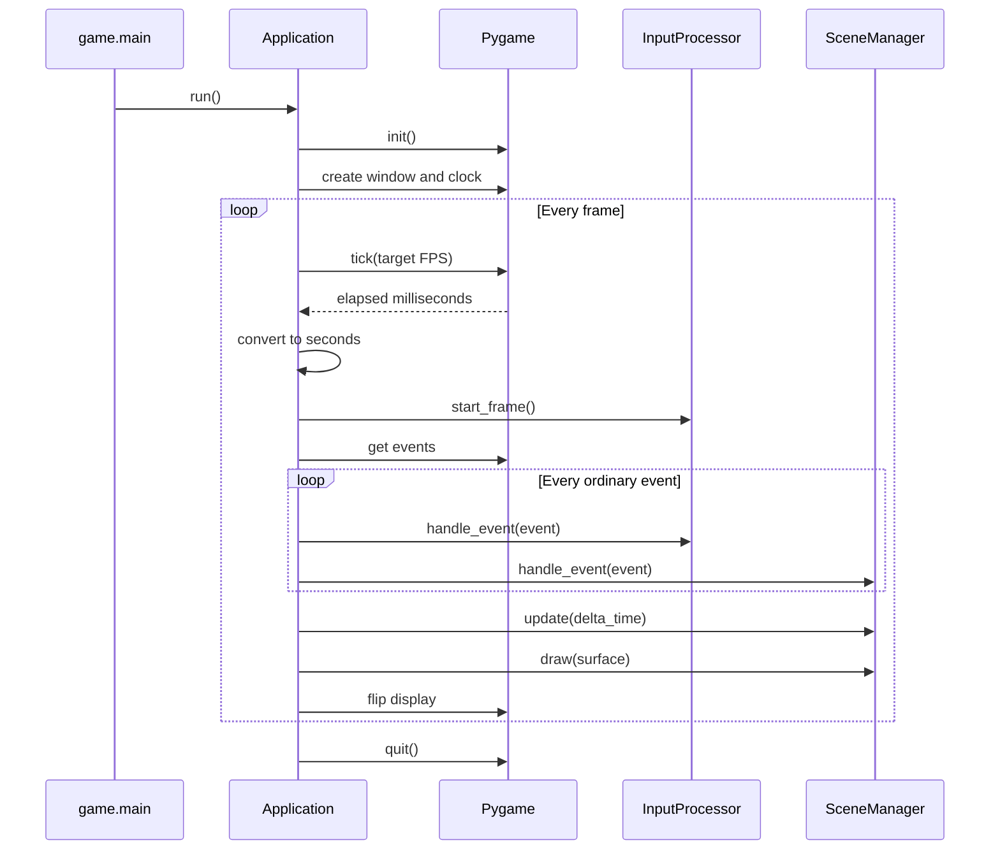

# Application domain

## Responsibility

The application domain owns the generic Pygame runtime lifecycle.

It is responsible for:

- initializing and shutting down Pygame;
- creating the window;
- maintaining the frame rate;
- calculating delta time;
- processing system events;
- advancing the input lifecycle;
- delegating events, updates, and rendering;
- presenting completed frames.

It does not implement game behavior or visual presentation.

## Why this domain exists

Without a dedicated application layer, the game entry point would need to own
the Pygame loop and coordinate every engine service directly.

Centralizing the runtime lifecycle provides one stable execution model while
allowing the game to choose the concrete window configuration, input processor,
and initial scene.

## Public components

### [`Application`](../api/application.md#my_first_adventure_game.engine.application.Application)

Runs the Pygame lifecycle and coordinates each frame.

Created by:

- `game.main`.

Depends on:

- `WindowConfig`;
- `InputProcessor`;
- `SceneManager`;
- Pygame.

Does not know:

- concrete game actions;
- concrete scenes;
- game colors or themes;
- entities, levels, scoring, or profiles.

### [`WindowConfig`](../api/application.md#my_first_adventure_game.engine.application.WindowConfig)

Stores the title and dimensions used to create the window.

The configuration is immutable after creation.

Created by:

- the game composition root.

Used by:

- `Application`.

## Runtime lifecycle

The system-level quit event stops the loop and is not forwarded to the input
processor or active scene.

## Frame invariants

For every completed frame:

1. delta time is expressed in seconds;
2. transient input states are cleared exactly once;
3. input processing occurs before scene event handling;
4. the active scene is updated exactly once;
5. the active scene is drawn exactly once;
6. the display is flipped after drawing.

The application currently completes the active frame after receiving a quit
event, then exits before beginning another frame.

## Error handling

Pygame shutdown is protected by a `finally` block.

If window creation or frame processing raises an exception, `pygame.quit()` is
still called before the exception continues to propagate.

The application does not currently convert engine errors into game-specific
error screens.

## Composition

The application receives its collaborators through its constructor.

It must not:

- create concrete game scenes;
- create concrete action bindings;
- import game modules;
- expose game-specific navigation methods;
- act as a service locator for scenes.

`game.main` remains responsible for assembling the object graph.

## Extension points

Future requirements may justify:

- explicit application shutdown requests;
- configurable window flags;
- fullscreen or resizing support;
- diagnostic frame metrics;
- controlled error presentation.

These capabilities should be added only when a concrete requirement appears.

Game-specific navigation, pause rules, and display themes are not application
extension points.

## Change risks

Changes to the application loop can affect every game system.

High-risk modifications include:

- changing the order of input and scene event processing;
- changing delta-time units;
- updating or drawing more than once per frame;
- forwarding system events that were previously consumed;
- allowing the application to construct game-owned objects;
- adding imports that create dependency cycles.

Any change to the frame lifecycle requires corresponding test and documentation
updates.

## Verification

Current tests verify:

- window configuration is applied;
- elapsed milliseconds are converted to seconds;
- the transient input lifecycle starts for the frame;
- ordinary events reach both the input processor and scene manager;
- the system-level quit event is not forwarded;
- the active scene receives events, updates, and drawing calls;
- the display is presented;
- Pygame shuts down when startup fails.
