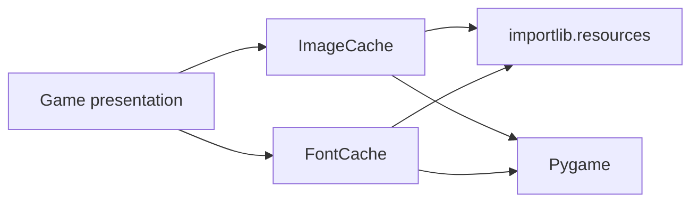

# Assets domain

## Responsibility

The assets domain loads and caches reusable Pygame resources stored in Python
packages.

It currently provides:

- package-based image loading;
- package-based font loading;
- image caching by resource path;
- font caching by resource path and size.

It does not define concrete resources, themes, colors, sizes, or presentation
rules.

## Why this domain exists

Loading resources directly from arbitrary filesystem paths would couple the
game to the current repository layout and could fail after package
installation.

The assets domain uses `importlib.resources` so resources can be read from
their owning Python package without assuming that they exist as ordinary
filesystem paths.

## Public components

### `ImageCache`

Loads images from a configured resource package.

Cache key:

```text
resource path
```

Repeated requests for the same path return the same `pygame.Surface`
instance.

`ImageCache` does not currently convert loaded surfaces with `convert()` or
`convert_alpha()`. Such conversion requires an initialized display and its
lifecycle has not yet been assigned to this domain.

### `FontCache`

Loads fonts from a configured resource package.

Cache key:

```text
(resource path, size)
```

Two requests for the same font resource at different sizes produce distinct
`pygame.font.Font` instances.

Font data is copied into an in-memory binary stream. The cache keeps that
stream alive with the font because SDL_ttf may continue reading it during text
rendering.

## Resource ownership

The engine owns the loading and caching mechanisms.

The game owns:

- concrete image and font files;
- resource paths;
- font sizes;
- colors and themes;
- decisions about where and how resources are rendered.

A cloned game can therefore replace its presentation resources without
modifying the engine caches.

## Dependencies



The assets domain must not import from `game`.

## Invariants

- Cached resources belong to a cache instance.
- An image path identifies one cached surface.
- A font path and size identify one cached font.
- Images are loaded from resources opened in binary mode.
- Font streams remain alive as long as their cached fonts.
- Missing or invalid resources propagate the underlying loading error.
- Resource loading does not choose game presentation rules.

## Extension points

Future requirements may add:

- explicit surface conversion after display initialization;
- additional resource types;
- cache inspection or clearing if a concrete lifecycle requires it.

These capabilities must not be added before a real consumer defines their
semantics.

## Change risks

Changes to cache keys can alter object identity and memory use.

Returning copied surfaces instead of cached instances would change the current
contract.

Introducing filesystem-only paths would break support for resources installed
inside package distributions.