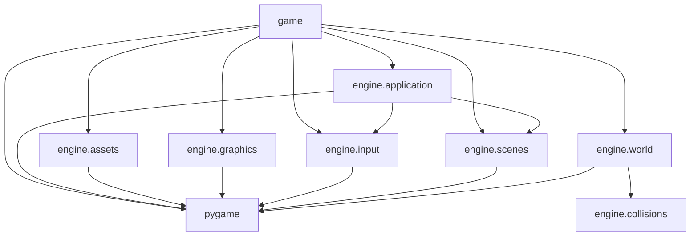

# Architectural boundaries

## Purpose

This document defines the dependency and responsibility boundaries that keep
the engine reusable across future top-down adventure games.

These rules are normative. When code and this document disagree, the mismatch
must be reviewed rather than silently accepted.

## Dependency direction

The primary dependency rule is:

```text
game → engine
```

The engine must never import the game.

Current engine dependencies are intentionally small:



A dependency cycle between engine domains is not allowed.

## Layer responsibilities

### Engine

The engine owns reusable mechanisms.

Examples include:

- application lifecycle;
- frame timing;
- scene management;
- device-independent action states;
- resource loading and caching;
- drawing primitives;
- world representation;
- collision detection;
- generic persistence mechanisms.

The engine may depend on:

- the Python standard library;
- Pygame;
- other engine domains when the dependency direction is explicit and
  acyclic.

The engine must not depend on:

- concrete game actions;
- concrete scenes;
- game colors or themes;
- player profiles;
- scoring or progression rules;
- level content;
- combat formulas;
- localization keys;
- achievements or quests.

### Game

The game owns meaning, content, and rules.

Examples include:

- concrete actions and default bindings;
- title, gameplay, pause, results, and profile scenes;
- player and enemy behavior;
- levels and maps;
- art direction;
- score calculation;
- combat and progression;
- profile schemas and statistics;
- localization content.

The game may depend on:

- the Python standard library;
- Pygame;
- public engine APIs;
- other game modules.

### Composition root

`game.main` is the composition root.

It creates concrete objects, connects dependencies, and starts the application.

The engine must not create game scenes, game actions, or game services.

## Mechanisms versus rules

A mechanism describes what can happen.

A rule decides what that event means for this game.

Examples:

| Mechanism owned by the engine  | Rule owned by the game                 |
| ------------------------------ | -------------------------------------- |
| An action is held              | The player moves left                  |
| Two rectangles overlap         | The player takes damage                |
| An entity was removed          | The score increases                    |
| Data can be stored atomically  | A profile records a completed level    |
| A map transition was requested | A particular destination map is loaded |

Whenever possible, the engine should expose facts and capabilities. The game
should decide their consequences.

## Scenes and maps

A scene represents a global application state.

Examples:

- title;
- gameplay;
- pause;
- results;
- profile.

A map represents spatial content managed inside a gameplay scene.

Changing maps must not automatically require changing scenes.

## Dependency injection

Scenes and game systems should receive only the services they need.

They should not receive the entire application merely for convenience.

Navigation must use explicit collaborators such as a scene manager rather than
game-specific methods added to the application.

## Public APIs

A domain exposes its intended public API through its package `__init__.py` and
`__all__`.

Code outside a domain should prefer those public imports.

Internal modules may import neighboring modules directly when necessary to
avoid circular package initialization.

A symbol being importable does not automatically make it a supported public
API.

## Abstraction criteria

A capability belongs in the engine only when all of the following are true:

1. it solves a current requirement or an explicit prerequisite in the accepted
   project roadmap;
2. it can be described without using game-specific rules or content;
3. it has a concrete use case or named future consumer in that roadmap;
4. it can be tested independently from a concrete game;
5. moving it into the engine reduces coupling rather than merely relocating code.

If no current game component consumes the capability yet, its planned consumer
and purpose must be identifiable. The capability must be reconsidered if the
roadmap changes before that consumer is implemented.

If these conditions are not met, the capability should remain in `game` until
its reusable mechanism becomes clear.

The project must not introduce abstractions solely for hypothetical future games.

## Genericity review

Before adding a new engine concept, ask:

1. Is this a reusable mechanism or a rule of the current game?
2. Would a Zelda-like game, an action RPG, and a traditional RPG use it without
   changing its meaning?
3. Does its API mention concrete player, score, profile, quest, or combat
   concepts?
4. Can the engine report a fact while allowing the game to choose the
   consequence?
5. What would a cloned game need to replace?
6. Is a smaller game-owned solution sufficient for the current requirement?

When an idea creates excessive coupling, document:

- its immediate impact;
- the cloning risk;
- the recommended layer;
- the smallest acceptable solution.

## Prohibited premature systems

Until a demonstrated requirement appears, do not introduce:

- an entity-component system;
- realistic physics;
- polygonal collision support;
- a universal event bus;
- a dependency injection framework;
- a custom map editor;
- a general scripting language;
- a standalone engine package;
- runtime metadata used only for documentation.

## Exceptions

An intentional exception to these boundaries requires:

1. a documented concrete need;
2. an architectural decision record;
3. tests protecting the new behavior;
4. an explanation of the effect on future cloned games.

Temporary convenience alone is not sufficient.

## Verification

Architectural boundaries should progressively become executable checks.

Planned checks include:

- detecting imports from `engine` to `game`;
- detecting dependency cycles between engine domains;
- verifying public API exports;
- verifying that generated dependency documentation is current.

Until those checks exist, code review and this document are the primary
safeguards.
