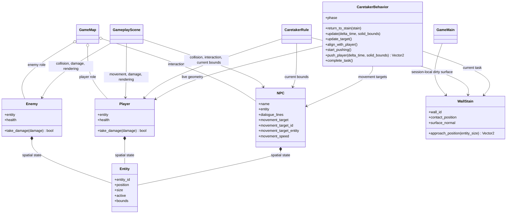

# Game entities domain

## Responsibility

The game entities domain defines concrete objects whose gameplay state extends
the reusable spatial state provided by the engine.

It currently provides `Enemy`, `NPC`, `Player`, `WallStain`, target-directed
NPC movement, and concrete Caretaker approach and push calculations. Concrete
spatial actors compose an engine `Entity` with the additional state required
by their game role. `WallStain` instead records game-owned surface state
without entering the engine world.

## Why this domain exists

The engine `Entity` deliberately contains only reusable identity, geometry, and
active state. Walls, collectibles, players, and enemies do not all require
health or share the same gameplay rules.

Keeping enemy and player health, NPC dialogue content, and their concrete rules
in `game` prevents combat and interaction vocabulary from leaking into the
generic world representation.

## Public components

### [`Enemy`](../api/game-entities.md#my_first_adventure_game.game.entities.Enemy)

Composes:

- an engine-owned `Entity` for identity, geometry, and active state;
- a positive integer health value owned by the game.

`take_damage()` requires a positive integer amount, clamps health to zero,
deactivates the spatial entity on the fatal hit, and reports whether that hit
caused the defeat. Further damage to an already defeated enemy does not report
another defeat.

### [`Player`](../api/game-entities.md#my_first_adventure_game.game.entities.Player)

Composes an engine-owned `Entity` with a positive integer health value.

Its damage contract matches the current enemy contract: positive damage is
required, health is clamped to zero, the spatial entity is deactivated by the
fatal hit, and only that hit reports a new defeat. The player does not decide
scene transitions or session consequences.

### [`NPC`](../api/game-entities.md#my_first_adventure_game.game.entities.NPC)

Composes an engine-owned `Entity` with a non-blank display name, a non-empty
tuple of ordered, non-blank dialogue lines, an optional movement target, and a
nonnegative movement speed. A target may be either a copied fixed position or a
live engine `Entity` reference whose current position is read during each
update. These target forms are mutually exclusive. A fixed position may also
carry an optional non-blank identifier so its exact arrival can be reported.

The NPC owns concrete game content but does not detect interaction, display its
text, select destinations, or decide scene transitions. Those responsibilities
remain with the gameplay scene, level content, and composition root. NPCs are
stationary by default; either configured target requires a positive speed.

### [`move_npc_towards`](../api/game-entities.md#my_first_adventure_game.game.entities.move_npc_towards)

Combines elapsed-time movement, the engine's target-directed calculation, and
axis-separated collision resolution for one NPC. It returns the movement
actually applied.

The caller still owns the destination, speed, frame duration, and selection of
solid bounds. The function performs no pathfinding.

### [`WallStain`](../api/game-entities.md#my_first_adventure_game.game.entities.WallStain)

Stores the stable identifier of a dirty wall, the exact contact point on its
surface, and an axis-aligned normal pointing toward the playable side. It is an
immutable game-owned fact rather than an engine spatial entity.

`approach_position()` derives the top-left position that places an entity of a
given size against the dirty point. The calculation does not move that entity,
inspect obstacles, choose a route, or decide what cleaning means.

### [`caretaker_sidestep_target`](../api/game-entities.md#my_first_adventure_game.game.entities.caretaker_sidestep_target)

Calculates the closest of the two positions beside the current player along a
stained wall. Horizontal surfaces produce left and right candidates; vertical
surfaces produce upper and lower candidates. The result is derived solely from
the current stain, Caretaker bounds, and player bounds, so calling it again
after player movement produces a fresh destination.

An optional [`CaretakerSide`](../api/game-entities.md#my_first_adventure_game.game.entities.CaretakerSide)
keeps a previously selected side stable while live geometry changes. Without
one, the nearest candidate is selected.

### [`caretaker_rounding_target`](../api/game-entities.md#my_first_adventure_game.game.entities.caretaker_rounding_target)

Derives the outer player corner for the chosen side and stained-wall normal.
It gives the Caretaker enough clearance to move around a player who blocks a
direct side-step.

### [`caretaker_push_movement`](../api/game-entities.md#my_first_adventure_game.game.entities.caretaker_push_movement)

Returns one player-sized movement parallel to the stained wall and away from
the Caretaker. The behavior controller uses its direction, then scales it by
the Caretaker speed and frame duration before collision resolution.

These calculations are concrete game rules rather than general pathfinding.
They do not inspect route obstacles, plan around room corners, or move entities
by themselves.

### [`CaretakerBehavior`](../api/game-entities.md#my_first_adventure_game.game.entities.CaretakerBehavior)

Coordinates the current Caretaker wall task from the injected Caretaker and
session player. `return_to_stain()` starts the return phase, `update()` advances
the current phase from live geometry and elapsed time, and `complete_task()`
returns the controller to its inert state while clearing every NPC target form.

When the stain approach position is free, the controller selects it as a named
fixed target. When the player occupies that position, it retains the initially
chosen side so changing distances cannot make the route oscillate. A Caretaker
already beyond that side moves directly into alignment. Otherwise it first
targets the matching outer corner, then aligns beside the player against the
wall.

After alignment, `start_pushing()` clears autonomous movement targets and
enters the push phase. Each update moves the player along the wall using active
wall collisions and applies the same resolved displacement to the Caretaker.
The controller returns to the stain target as soon as its approach bounds are
clear. The implemented [`CaretakerPhase`](../api/game-entities.md#my_first_adventure_game.game.entities.CaretakerPhase)
values are `IDLE`, `RETURNING_TO_STAIN`, `ROUNDING_PLAYER`, `SIDESTEPPING`, and
`PUSHING_PLAYER`.

## Relationships

`create_demo_map()` creates the current enemy with two health points and
registers only its spatial `Entity` in the engine-owned `World`.

`GameplayScene` applies one point of game-owned attack damage. It emits
`EnemyDefeated` only when `take_damage()` reports the fatal hit. After a
non-fatal hit, the scene temporarily renders the enemy with a game-owned damage
feedback color; this presentation timer does not belong to `Enemy`.

The demo player starts with three health points. Contact with an active enemy
applies one point of damage, after which the scene provides a short
invulnerability period. The scene displays current health and emits
`PlayerDefeated` after fatal damage.

## Invariants

- Initial enemy health is strictly positive.
- Applied damage is strictly positive.
- Health never becomes negative.
- A non-fatal hit leaves the spatial entity active.
- A fatal hit sets health to zero and deactivates the spatial entity.
- Only the fatal hit reports a new defeat.
- The engine never imports or constructs `Enemy` or `Player`.
- Every NPC has at least one dialogue line.
- Every NPC has a non-blank display name.
- NPC dialogue lines are ordered and none are blank.
- NPC movement speed cannot be negative.
- NPCs without a target are stationary by default.
- Fixed and entity movement targets are mutually exclusive.
- A fixed target identifier is optional, non-blank when present, and invalid
  without its associated fixed position.
- A configured target requires a positive movement speed.
- A fixed target is copied during construction.
- A target entity remains the same object so its current position can be read
  during later updates.
- The engine never imports or constructs `NPC`.
- A wall stain is immutable and remains outside the engine world.
- Its approach position depends only on the recorded contact geometry and the
  supplied entity size.
- Caretaker corner, side-step, and push calculations follow the stained wall's
  orientation.
- One side is retained during a blocked approach and cleared when the approach
  becomes free or the task completes.
- An already lateral Caretaker does not take an unnecessary outer-corner route.
- A push moves the Caretaker by exactly the collision-resolved player movement.
- An idle Caretaker behavior does not change movement targets.
- Completing a wall task clears the stain, phase, and every movement target
  form so later updates cannot recreate the completed task.

## Extension points

Concrete requirements may later add enemy movement, attack behavior, damage
animations, or distinct enemy configurations.

Although the current player and enemy damage contracts match, a reusable health
component, combatant hierarchy, or damage system should not be introduced until
a concrete requirement needs shared behavior beyond this small duplication.

## Change risks

- Adding health to the engine `Entity` would force combat state onto unrelated
  spatial objects.
- Inheriting from `Entity` would couple concrete enemy rules to the engine's
  storage model more tightly than composition requires.
- Emitting `EnemyDefeated` for every hit would confuse damage with defeat.
- Allowing negative health would make defeat state ambiguous.

## Verification

Current tests verify:

- storage of the composed entity and initial health;
- rejection of non-positive initial health and damage;
- survival after a non-fatal hit;
- health clamping and entity deactivation after a fatal hit;
- one defeat report across later damage attempts;
- two player attacks are required to defeat the demo enemy.
- storage, validation, non-fatal damage, and fatal damage for the player;
- one player defeat report across later damage attempts;
- enemy contact damage, temporary invulnerability, and fatal player
  deactivation.
- storage of an NPC display name, spatial state, and ordered dialogue lines;
- rejection of blank NPC names;
- rejection of empty dialogue sequences and blank dialogue lines.
- stationary movement defaults, fixed-target copying, live target-entity
  references, optional fixed-target identifiers, mutually exclusive target
  forms, and movement-speed validation;
- elapsed-time NPC movement, exact arrival, and collision against selected
  solid bounds;
- immutable wall-stain geometry and approach positions for all four
  axis-aligned surface normals;
- nearest-side, outer-corner, side-step, and push calculations for horizontal
  and vertical surfaces;
- stable side selection while player and Caretaker geometry changes;
- direct lateral alignment when an outer-corner detour is unnecessary;
- controller transitions through returning, rounding, side-stepping, and
  continuous pushing as the player occupies or frees the stain approach;
- wall-limited coupled movement of the player and Caretaker during a push;
- completed tasks remain idle across later target updates.
