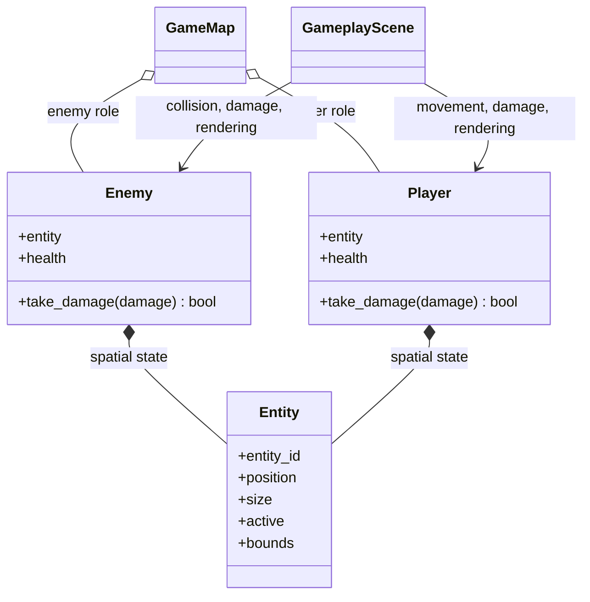

# Game entities domain

## Responsibility

The game entities domain defines concrete objects whose gameplay state extends
the reusable spatial state provided by the engine.

It currently provides `Enemy` and `Player`. Each composes an engine `Entity`
with mutable health and concrete damage behavior.

## Why this domain exists

The engine `Entity` deliberately contains only reusable identity, geometry, and
active state. Walls, collectibles, players, and enemies do not all require
health or share the same gameplay rules.

Keeping enemy and player health in `game` prevents combat vocabulary from
leaking into the generic world representation.

## Public components

### [`Enemy`](../api/game-entities.md#my_first_adventure_game.game.entities.Enemy)

Composes:

- an engine-owned `Entity` for identity, geometry, and active state;
- a positive integer health value owned by the game.

`take_damage()` requires a positive integer amount, clamps health to zero,
deactivates the spatial entity on the fatal hit, and reports whether that hit
caused the defeat. Further damage to an already defeated enemy does not report
another defeat.

### [`Player`](../api/game-entities.md#my_first_adventure_game.game.entities.Player)

Composes an engine-owned `Entity` with a positive integer health value.

Its damage contract matches the current enemy contract: positive damage is
required, health is clamped to zero, the spatial entity is deactivated by the
fatal hit, and only that hit reports a new defeat. The player does not decide
scene transitions or session consequences.

## Relationships

`create_demo_map()` creates the current enemy with two health points and
registers only its spatial `Entity` in the engine-owned `World`.

`GameplayScene` applies one point of game-owned attack damage. It emits
`EnemyDefeated` only when `take_damage()` reports the fatal hit. After a
non-fatal hit, the scene temporarily renders the enemy with a game-owned damage
feedback color; this presentation timer does not belong to `Enemy`.

The demo player starts with three health points. Contact with an active enemy
applies one point of damage, after which the scene provides a short
invulnerability period. The scene displays current health and emits
`PlayerDefeated` after fatal damage.

## Invariants

- Initial enemy health is strictly positive.
- Applied damage is strictly positive.
- Health never becomes negative.
- A non-fatal hit leaves the spatial entity active.
- A fatal hit sets health to zero and deactivates the spatial entity.
- Only the fatal hit reports a new defeat.
- The engine never imports or constructs `Enemy` or `Player`.

## Extension points

Concrete requirements may later add enemy movement, attack behavior, damage
animations, or distinct enemy configurations.

Although the current player and enemy damage contracts match, a reusable health
component, combatant hierarchy, or damage system should not be introduced until
a concrete requirement needs shared behavior beyond this small duplication.

## Change risks

- Adding health to the engine `Entity` would force combat state onto unrelated
  spatial objects.
- Inheriting from `Entity` would couple concrete enemy rules to the engine's
  storage model more tightly than composition requires.
- Emitting `EnemyDefeated` for every hit would confuse damage with defeat.
- Allowing negative health would make defeat state ambiguous.

## Verification

Current tests verify:

- storage of the composed entity and initial health;
- rejection of non-positive initial health and damage;
- survival after a non-fatal hit;
- health clamping and entity deactivation after a fatal hit;
- one defeat report across later damage attempts;
- two player attacks are required to defeat the demo enemy.
- storage, validation, non-fatal damage, and fatal damage for the player;
- one player defeat report across later damage attempts;
- enemy contact damage, temporary invulnerability, and fatal player
  deactivation.
