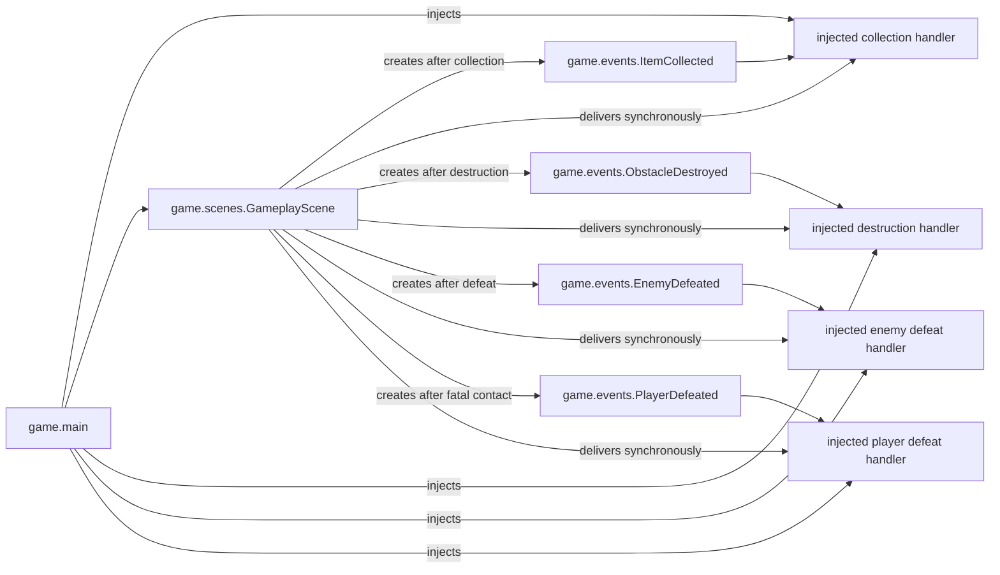

# Events domain

## Responsibility

The game events domain defines immutable facts produced by concrete gameplay
behavior.

It currently provides `ItemCollected`, which identifies an item collected by
the player, `ObstacleDestroyed`, which identifies a destructible obstacle
removed by an attack, `EnemyDefeated`, which identifies a defeated enemy, and
`PlayerDefeated`, which identifies the defeated player.

The domain does not calculate score, update session state, persist statistics,
or provide a general event dispatcher.

## Why this domain exists

Gameplay behavior needs to report what happened without deciding every
consequence of that fact.

Separating an event from its consumers allows collection to later affect score,
session summaries, profiles, or presentation without coupling those concerns to
`GameplayScene`.

## Public components

### [`ItemCollected`](../api/game-events.md#my_first_adventure_game.game.events.ItemCollected)

Reports that an item was collected.

It contains only the stable identifier of that item. It is immutable so
consumers receive a factual snapshot that cannot be altered after emission.

### [`ObstacleDestroyed`](../api/game-events.md#my_first_adventure_game.game.events.ObstacleDestroyed)

Reports that a destructible obstacle was destroyed.

It contains only the stable identifier of that obstacle and is immutable.

### [`EnemyDefeated`](../api/game-events.md#my_first_adventure_game.game.events.EnemyDefeated)

Reports that an enemy was defeated.

It contains only the stable identifier of that enemy and is immutable. It does
not define score, experience, loot, or progression consequences.

### [`PlayerDefeated`](../api/game-events.md#my_first_adventure_game.game.events.PlayerDefeated)

Reports that the player was defeated. It contains only the stable player
identifier and does not decide navigation, retry, or session consequences.

## Ownership

These events belong to `game` because collection, attacks, destruction, and
player defeat are concrete game vocabulary rather than reusable engine
mechanisms.

The engine provides entity identity and overlap detection. The game decides
that a particular overlap represents collection and emits the corresponding
fact. It also decides that an attack near a destructible obstacle destroys it.

## Relationships

The handler composed in `game.main` converts `ItemCollected` into points through
the game-owned scoring rule and adds them to the current `SessionScore`. The
event itself remains independent from that consequence.

The destruction, enemy defeat, and player defeat handlers currently have no
additional consequence. The scene deactivates the corresponding entity before
reporting the factual event.

## Delivery semantics

- `GameplayScene` detects collection after player movement.
- The overlapping active item is deactivated before the event is delivered.
- One `ItemCollected` value is delivered through the injected callback.
- An inactive item cannot emit the event again on later frames.
- Delivery is synchronous and local to the gameplay scene.
- `GameplayScene` deactivates an active destructible obstacle within attack
  reach before delivering one `ObstacleDestroyed` value.
- An inactive obstacle cannot emit the destruction event again.
- `GameplayScene` deactivates an active enemy within attack reach before
  delivering one `EnemyDefeated` value.
- An inactive enemy cannot emit the defeat event again.
- Fatal enemy contact deactivates the player before one `PlayerDefeated` value
  is delivered.
- An inactive player cannot emit another defeat event on later frames.

There is no global event bus, subscription registry, or runtime event queue.

## Extension points

Additional factual event types should be introduced only when concrete gameplay
behavior produces them.

The injected handlers may later coordinate additional session or presentation
consequences without changing the factual events themselves.

## Change risks

- Moving concrete gameplay events into `engine` would leak game vocabulary into
  reusable mechanisms.
- Adding score or profile mutations to `ItemCollected` would mix a fact with
  its consequences.
- Introducing a universal event bus would add indirection before the project
  demonstrates a need for multiple dynamic subscribers.
- Emitting events for inactive items would repeat one gameplay fact across
  multiple frames.

## Verification

Current tests verify:

- `ItemCollected` stores the collected item identifier;
- the event is immutable;
- collecting an active overlapping item deactivates it;
- the event is delivered exactly once across subsequent updates;
- distant items remain active.
- `ObstacleDestroyed` stores the destroyed obstacle identifier and is
  immutable;
- attacking near an active destructible obstacle deactivates it and delivers
  its event exactly once;
- distant destructible obstacles remain active.
- `EnemyDefeated` stores the defeated enemy identifier and is immutable;
- attacking near an active enemy deactivates it and delivers its event exactly
  once;
- distant enemies remain active.
- `PlayerDefeated` stores the defeated player identifier and is immutable;
- fatal enemy contact delivers player defeat exactly once.
