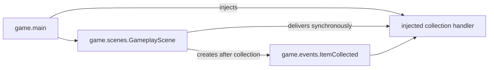

# Events domain

## Responsibility

The game events domain defines immutable facts produced by concrete gameplay
behavior.

It currently provides `ItemCollected`, which identifies an item collected by
the player.

The domain does not calculate score, update session state, persist statistics,
or provide a general event dispatcher.

## Why this domain exists

Gameplay behavior needs to report what happened without deciding every
consequence of that fact.

Separating an event from its consumers allows collection to later affect score,
session summaries, profiles, or presentation without coupling those concerns to
`GameplayScene`.

## Public components

### [`ItemCollected`](../api/game-events.md#my_first_adventure_game.game.events.ItemCollected)

Reports that an item was collected.

It contains only the stable identifier of that item. It is immutable so
consumers receive a factual snapshot that cannot be altered after emission.

## Ownership

`ItemCollected` belongs to `game` because collecting an item is concrete game
vocabulary rather than a reusable engine mechanism.

The engine provides entity identity and overlap detection. The game decides
that a particular overlap represents collection and emits the corresponding
fact.

## Relationships

The handler composed in `game.main` converts `ItemCollected` into points through
the game-owned scoring rule and adds them to the current `SessionScore`. The
event itself remains independent from that consequence.

## Delivery semantics

- `GameplayScene` detects collection after player movement.
- The overlapping active item is deactivated before the event is delivered.
- One `ItemCollected` value is delivered through the injected callback.
- An inactive item cannot emit the event again on later frames.
- Delivery is synchronous and local to the gameplay scene.

There is no global event bus, subscription registry, or runtime event queue.

## Extension points

Additional factual event types should be introduced only when concrete gameplay
behavior produces them.

The injected collection handler may later coordinate additional session or
presentation consequences without changing the collection event itself.

## Change risks

- Moving concrete gameplay events into `engine` would leak game vocabulary into
  reusable mechanisms.
- Adding score or profile mutations to `ItemCollected` would mix a fact with
  its consequences.
- Introducing a universal event bus would add indirection before the project
  demonstrates a need for multiple dynamic subscribers.
- Emitting events for inactive items would repeat one gameplay fact across
  multiple frames.

## Verification

Current tests verify:

- `ItemCollected` stores the collected item identifier;
- the event is immutable;
- collecting an active overlapping item deactivates it;
- the event is delivered exactly once across subsequent updates;
- distant items remain active.