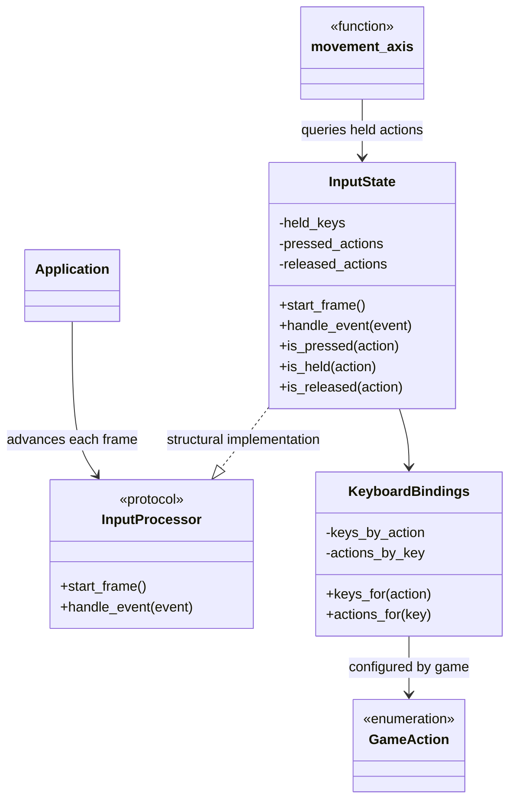

# Input domain

## Responsibility

The input domain converts Pygame device events into action-oriented state.

It is responsible for:

- mapping keyboard keys to generic action identifiers;
- tracking pressed, held, and released actions for each frame;
- separating the application loop from concrete input implementations;
- calculating normalized directional movement axes.

It does not decide what an action means for the game.

## Why this domain exists

Game entities should depend on actions such as move, interact, or pause rather
than directly querying keyboard keys.

This separation allows:

- controls to be remapped;
- multiple keys to trigger the same action;
- several actions to share a key when deliberately configured;
- future input devices to preserve the same action-oriented game logic;
- input behavior to be tested without constructing a player.

## Public components

### [`InputProcessor`](../api/input.md#my_first_adventure_game.engine.input.InputProcessor)

Defines the lifecycle required by `Application`.

Required methods:

- `start_frame()`;
- `handle_event(event)`.

Used by:

- `Application`.

Structurally implemented by:

- `InputState`.

The application depends only on this protocol. It does not know action
identifiers or query action state.

### [`KeyboardBindings`](../api/input.md#my_first_adventure_game.engine.input.KeyboardBindings)

Maps generic action identifiers to integer key codes.

The action type must be hashable. The engine does not require a particular
enumeration or string format.

Provides:

- `keys_for(action)`;
- `actions_for(key)`.

Stored key and action collections are exposed as immutable `frozenset` values.

### [`InputState`](../api/input.md#my_first_adventure_game.engine.input.InputState)

Tracks action state across frames.

Provides:

- `is_pressed(action)`;
- `is_held(action)`;
- `is_released(action)`.

Its public query API is action-oriented. Its current event ingestion is backed
by keyboard bindings and Pygame key events.

### [`movement_axis`](../api/input.md)

Produces a `pygame.Vector2` from four directional actions.

The function receives the action identifiers explicitly. It does not know
concrete game actions.

## Relationships

`GameAction` belongs to `game`. The other components in this diagram belong to
`engine`.

## Frame lifecycle

At the beginning of every frame, `Application` calls `start_frame()`.

This clears:

- pressed actions from the previous frame;
- released actions from the previous frame.

It preserves:

- keys that remain held.

For every ordinary Pygame event, the application updates the input processor
before forwarding the event to the active scene.

## Action-state semantics

### Pressed

An action is pressed when a bound key changes the action from not held to held
during the current frame.

A repeated key-down event for an already held action does not press it again.

### Held

An action is held while at least one bound key remains held.

Held state persists across frames.

### Released

An action is released when its last held key is released during the current
frame.

If two keys are bound to one action, releasing only one does not release the
action.

## Keyboard-binding semantics

The current binding model supports:

- one action with several keys;
- one key with several actions;
- unknown actions with no keys;
- unknown keys with no actions.

Bindings describe configuration. They do not contain gameplay consequences.

## Movement-axis semantics

Screen coordinates use:

- left as negative horizontal movement;
- right as positive horizontal movement;
- up as negative vertical movement;
- down as positive vertical movement.

Opposite directions cancel each other.

Cardinal movement has a vector length of `1`.

Diagonal movement is normalized to a vector length of `1`, preventing diagonal
movement from being faster than horizontal or vertical movement.

The movement axis is an engine mechanism. The game decides which entity moves,
its speed, and whether movement is currently allowed.

## Game integration

The game defines:

- [`GameAction`](../api/game-input.md#my_first_adventure_game.game.input.GameAction);
- [`DEFAULT_KEYBOARD_BINDINGS`](../api/game-input.md#my_first_adventure_game.game.input.DEFAULT_KEYBOARD_BINDINGS).

Current concrete actions are:

- `MOVE_LEFT`;
- `MOVE_RIGHT`;
- `MOVE_UP`;
- `MOVE_DOWN`;
- `ATTACK`;
- `CONFIRM`.

Directional actions are bound to the arrow keys. `ATTACK` is bound to Space and
`CONFIRM` is bound to Enter.

`game.main` creates the concrete `InputState` and passes it to `Application` as
an `InputProcessor`.

`TitleScene` queries the pressed state of `CONFIRM` to request the transition to
gameplay. `GameplayScene` queries held directional actions to move the player
and the pressed state of `ATTACK` to apply the game-owned proximity attack.

## Device extensibility

The public action-query behavior should remain stable when future devices are
added.

Controller support may require:

- additional binding types;
- additional event processing;
- a combined processor;
- a dedicated read-only action-state contract.

Those choices must be driven by a concrete controller requirement.

Future entities must not query Pygame keyboard or controller state directly.

## Invariants

- The engine never defines concrete game actions.
- Transient pressed and released states last for one frame.
- Held state survives frame boundaries.
- Repeated key-down events do not create repeated presses.
- An action remains held until every bound key is released.
- Opposite directions cancel.
- Diagonal movement is normalized.
- Input processing occurs before scene event handling.
- Game entities do not query device state directly.

## Extension points

Future requirements may justify:

- controller bindings;
- analog movement axes;
- input rebinding;
- focus-loss handling;
- configurable dead zones;
- combined keyboard and controller input;
- a read-only action-state protocol for consumers.

These extensions must preserve action-oriented game code.

## Change risks

High-risk modifications include:

- clearing held state at frame start;
- treating every repeated key-down as a new press;
- releasing an action while another bound key remains held;
- moving concrete game actions into the engine;
- exposing raw device state to entities;
- changing directional coordinate conventions;
- removing diagonal normalization without changing movement rules;
- coupling `Application` to a concrete action type.

## Verification

Current tests verify:

- forward and reverse keyboard mappings;
- empty results for unknown actions and keys;
- pressed, held, and released transitions;
- transient-state clearing between frames;
- repeated key-down handling;
- multiple keys bound to one action;
- cardinal direction conventions;
- cancellation of opposite directions;
- diagonal normalization;
- concrete default arrow-key, attack, and confirmation bindings;
- title navigation triggered only by a newly pressed confirmation action;
- integration of the input lifecycle into `Application`.
