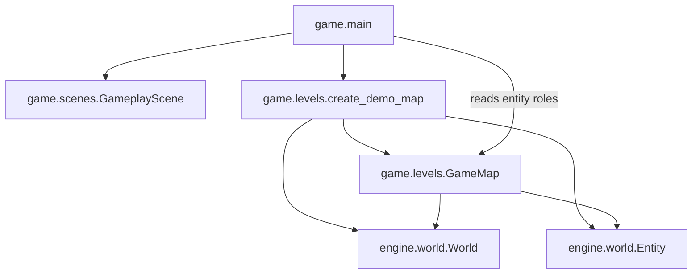

# Levels domain

## Responsibility

The game levels domain defines the concrete spatial content used during gameplay.

It currently provides:

- `GameMap`, which groups a world with the entities whose roles matter to the game;
- `create_demo_map()`, which creates the first Python-authored map.

This domain belongs to `game`, not `engine`.

## Why this domain exists

The gameplay scene needs concrete spatial content without owning every entity
definition and placement itself.

Keeping this content in a dedicated game domain separates map construction from
scene behavior while preserving the distinction between scenes and maps.

## Public components

### [`GameMap`](../api/game-levels.md#my_first_adventure_game.game.levels.GameMap)

Groups:

- the `World` containing all registered entities;
- the player entity;
- the wall entities used as solid obstacles;
- the entities assigned the collectible role by the game.

The dataclass is immutable, but the grouped world and entities remain mutable.

### [`create_demo_map`](../api/game-levels.md#my_first_adventure_game.game.levels.create_demo_map)

Creates the current demonstration map entirely in Python.

It registers the player, walls, and collectibles in deterministic order. Their
initial geometry keeps the player and collectibles outside the walls and prevents
collectibles from overlapping the player.

The concrete identifiers, positions, sizes, and entity roles belong to the game.

## Ownership

The engine owns reusable world storage, spatial entities, bounds, and movement
resolution.

The game levels domain owns:

- concrete map layouts;
- player, wall, and collectible roles;
- entity identifiers;
- initial positions and sizes;
- the selection and ordering of map content.

## Relationships

`game.main` creates the demo map and passes its player, walls, and collectibles
to `GameplayScene`. The scene consumes these concrete roles without depending
on the `GameMap` container itself.

A map is spatial content managed during gameplay. It is not a scene and is not
managed by `SceneManager`.

## Invariants

- The player, every wall, and every collectible are registered in the same world.
- Entity identifiers are unique within the map.
- Registration order is deterministic.
- The map contains at least one wall and one collectible.
- The player starts outside every wall.
- Every collectible starts outside the player and every wall.
- Wall bounds are distinct.

## Extension points

Additional Python-authored map factories may return other `GameMap` instances.

A serialized map format, external editor, or generic loading abstraction should
only be introduced when a concrete content-authoring requirement demonstrates
the need.

## Change risks

Moving `GameMap` into the engine would leak concrete player, wall, and
collectible roles into a reusable mechanism.

Treating maps as scenes would couple spatial navigation to global application
state.

Adding a generic map format prematurely would create an abstraction before the
required content model is known.
