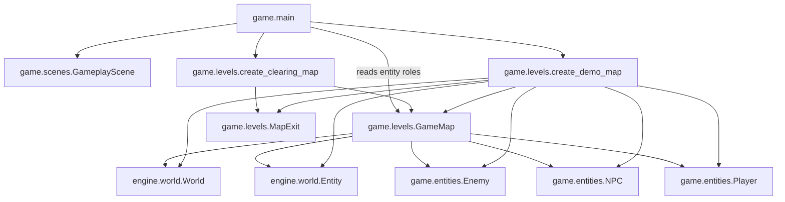

# Levels domain

## Responsibility

The game levels domain defines the concrete spatial content used during gameplay.

It currently provides:

- `GameMap`, which groups a stable map identifier, a world, and the entities
  whose roles matter to the game;
- `MapExit`, which describes a spatial trigger and its concrete destination;
- `create_demo_map()`, which creates the first Python-authored map;
- `create_clearing_map()`, which creates a minimal second map around the
  current session player.

This domain belongs to `game`, not `engine`.

## Why this domain exists

The gameplay scene needs concrete spatial content without owning every entity
definition and placement itself.

Keeping this content in a dedicated game domain separates map construction from
scene behavior while preserving the distinction between scenes and maps.

## Public components

### [`GameMap`](../api/game-levels.md#my_first_adventure_game.game.levels.GameMap)

Groups:

- the `World` containing all registered entities;
- the game-owned `Player`, including its reusable spatial entity;
- the wall entities used as solid obstacles;
- the `Enemy` objects assigned the enemy role by the game;
- the `NPC` objects assigned the interaction role by the game;
- the wall entities assigned the destructible obstacle role by the game;
- the entities assigned the collectible role by the game.
- the spatial exits available from the map.

The dataclass is immutable, but the grouped world, entities, and enemies remain
mutable.

### [`create_demo_map`](../api/game-levels.md#my_first_adventure_game.game.levels.create_demo_map)

Creates the current demonstration map entirely in Python.

It registers the player's spatial entity, walls, enemy and NPC spatial
entities, and collectibles in deterministic order. One wall is also assigned
the destructible obstacle role. Their initial geometry keeps the player,
enemies, NPCs, and collectibles outside the walls and prevents collectibles
from overlapping the player. Objective collectibles start inactive and are
activated by the concrete progression rule after the first Guide interaction.

The concrete identifiers, positions, sizes, and entity roles belong to the game.

### [`MapExit`](../api/game-levels.md#my_first_adventure_game.game.levels.MapExit)

Associates an active spatial entity with a destination map identifier and the
player position to apply after arrival. `GameplayScene` detects overlap and
reports the selected exit to the composition root; it does not decide which
map to load.

### [`create_clearing_map`](../api/game-levels.md#my_first_adventure_game.game.levels.create_clearing_map)

Creates the current minimal clearing map with the player supplied by the
active session. Its return exit leads back to the demo map. The clearing is a
technical navigation target and does not yet represent finished game content.

## Ownership

The engine owns reusable world storage, spatial entities, bounds, and movement
resolution.

The game levels domain owns:

- concrete map layouts;
- player, wall, enemy, NPC, destructible obstacle, and collectible roles;
- entity identifiers;
- initial positions and sizes;
- the selection and ordering of map content.
- stable map identifiers, exit destinations, and arrival positions.

## Relationships

`game.main` creates the demo and clearing maps for each new session. Both maps
share the same `Player`. It initially passes the demo roles and exits to
`GameplayScene`; later changes replace the scene's spatial content from the
selected `GameMap` while preserving the scene and session collaborators.

A map is spatial content managed during gameplay. It is not a scene and is not
managed by `SceneManager`.

## Invariants

- The player and every map-owned spatial entity, including exits, are
  registered in the same world.
- Entity identifiers are unique within the map.
- Every map has a stable identifier used by concrete exit destinations.
- Every exit entity is registered in its map's world.
- Registration order is deterministic.
- Maps created for the same session share the same player object.

The demo map additionally guarantees:

- The map contains at least one wall and one collectible.
- Every objective collectible starts inactive.
- The map contains at least one active enemy.
- The map contains at least one active NPC with a non-blank display name and
  ordered, non-blank dialogue lines.
- At least one demo NPC provides multiple lines so the map exercises dialogue
  advancement.
- The current demo enemy starts with two health points.
- The current demo player starts with three health points.
- Enemies are not registered as walls.
- The map contains at least one active destructible obstacle.
- Every destructible obstacle is also registered as a wall.
- The player starts outside every wall.
- Every collectible starts outside the player and every wall.
- Wall bounds are distinct.

## Extension points

Additional Python-authored map factories may return other `GameMap` instances.

A serialized map format, external editor, or generic loading abstraction should
only be introduced when a concrete content-authoring requirement demonstrates
the need.

## Change risks

Moving `GameMap` into the engine would leak concrete player, wall, enemy, NPC,
destructible obstacle, and collectible roles into a reusable mechanism.

Treating maps as scenes would couple spatial navigation to global application
state.

Adding a generic map format prematurely would create an abstraction before the
required content model is known.
