# Architecture overview

## Purpose

My First Adventure Game has two related goals:

1. build a small reusable engine for top-down 2D games with Pygame;
2. build a complete game that exercises the engine through real requirements.

The engine is internal to the repository. It is specialized for small adventure
games and is not intended to be a universal game engine.

## Fundamental separation

The source code is divided into two main areas:

### `engine`

Provides reusable technical capabilities independent of game rules and
content.

The engine must not know:

- concrete game actions;
- player profiles or statistics;
- scoring rules;
- game text or localization keys;
- game colors or artistic direction;
- concrete levels, entities, or combat rules.

### `game`

Defines the concrete application assembled from engine capabilities.

The game owns:

- concrete actions and default controls;
- scenes specific to the game;
- visual presentation;
- entities and levels;
- scoring and progression;
- localization;
- profile data and gameplay rules.

The dependency direction is always:

```text
game → engine
```

The engine must never import the game.

## Implemented domains

### Application

Owns the Pygame lifecycle, window creation, frame timing, event dispatch, scene
updates, rendering, and shutdown.

### Scenes

Defines the scene contract and manages the active scene.

A scene represents a global application state, such as a title screen,
gameplay, pause, results, or profile.

A map represents spatial content loaded by a gameplay scene. A map is not a
scene.

### Input

Converts device events into game-independent action states.

The engine tracks whether an action was pressed, held, or released during the
current frame. Concrete action names and default keys belong to the game.

### Assets

Loads and caches Pygame images and fonts stored in Python packages.

The engine owns package-based loading and caching. Concrete resource files,
paths, sizes, themes, and presentation decisions belong to the game.

### Graphics

Provides small tested drawing operations without owning game presentation
rules.

The current implementation renders centered antialiased text, returns its
destination rectangle, and advances looping or one-shot image-frame animations
using elapsed time.

### Collisions

Provides immutable floating-point axis-aligned bounds and positive-area overlap
detection.

The engine reports geometric overlap. The game decides its consequences.

### World

Provides lightweight entities with stable identity, floating-point geometry,
active state, deterministic lookup, and axis-separated movement against
immutable collision bounds.

Concrete entity types, solid obstacle selection, and behavior belong to the
game.

## Implemented game foundations

### Events

Defines immutable facts produced by concrete gameplay behavior.

The current `ItemCollected` and `ObstacleDestroyed` events identify concrete
gameplay facts without deciding their consequences.

### Scoring

Defines concrete game-owned point rules and the mutable score for the current
session.

An item collection currently awards 100 points. `game.main` converts each
`ItemCollected` fact into points, accumulates them in `SessionScore`, and shares
that score with `GameplayScene` for display.

### Scenes

Provides the concrete title and gameplay scenes.

The title scene requests an explicit transition to gameplay when the
confirmation action is pressed.

The gameplay scene converts game actions into player movement, selects active
walls as solid obstacles, deactivates collectibles overlapping the player,
destroys nearby destructible obstacles when attacking, emits factual events,
prioritizes one-shot collection and attack animations over movement and idle
presentation, and displays the current session score.

### Levels

Defines the first Python-authored game map.

`GameMap` groups the reusable world representation with the concrete player,
wall, destructible obstacle, and collectible roles owned by the game.
`create_demo_map()` defines their initial geometry and registration order.

## Reserved domains

The package skeleton also reserves locations for capabilities that have not yet
been implemented:

- persistence;
- game entities;
- profiles;
- localization.

Reserved packages communicate intended organization, not completed features.

## Runtime composition

The game entry point creates the concrete objects and connects them together.

```mermaid
flowchart TD
    GameMain["game.main"]
    Application["Application"]
    WindowConfig["WindowConfig"]
    InputProcessor["InputProcessor"]
    InputState["InputState"]
    KeyboardBindings["KeyboardBindings"]
    SceneManager["SceneManager"]
    Scene["Scene"]
    TitleScene["TitleScene"]
    GameplayScene["GameplayScene"]
    DemoMap["create_demo_map"]
    GameMap["GameMap"]
    World["World"]
    Entity["Entity"]
    ItemCollected["ItemCollected"]
    ObstacleDestroyed["ObstacleDestroyed"]
    ItemCollectionPoints["item_collection_points"]
    SessionScore["SessionScore"]
    Animation["Animation"]
    FontCache["FontCache"]
    DrawText["draw_text"]

    GameMain --> Application
    GameMain --> InputState
    GameMain --> SceneManager
    GameMain -->|"injects transition callback"| TitleScene
    GameMain --> GameplayScene
    GameMain --> DemoMap
    GameMain --> ItemCollectionPoints
    GameMain --> SessionScore
    GameMain --> Animation
    GameMain --> FontCache

    DemoMap --> GameMap
    GameMap --> World
    GameMap --> Entity

    Application --> WindowConfig
    Application --> InputProcessor
    Application --> SceneManager

    TitleScene --> FontCache
    TitleScene --> DrawText
    TitleScene --> InputState

    GameplayScene --> InputState
    GameplayScene --> Entity
    GameplayScene --> ItemCollected
    GameplayScene --> ObstacleDestroyed
    GameplayScene --> SessionScore
    GameplayScene --> Animation
    GameplayScene --> FontCache
    GameplayScene --> DrawText

    InputState -. "implements structurally" .-> InputProcessor
    InputState --> KeyboardBindings
    SceneManager --> Scene
    TitleScene -. "implements" .-> Scene
    GameplayScene -. "implements" .-> Scene
```



`game.main` creates the demo map, current `SessionScore`, and temporary
two-frame idle, movement, collection, and attack animations, then composes
`GameplayScene` from its gameplay entities, shared rendering services, score,
animations, and explicit collection and destruction handlers. `GameplayScene`
selects idle or
movement presentation from directional intent, gives one-shot collection
presentation priority until completion, advances and renders the selected
animation, and delivers an `ItemCollected` fact when an active collectible is
collected. A newly pressed attack deactivates a nearby active destructible
obstacle, removes it from later collision and rendering, and delivers an
`ObstacleDestroyed` fact. The same input starts a one-shot attack presentation
that has priority over movement and idle animation.

The collection handler converts that fact through `item_collection_points()`
and adds the result to the same `SessionScore` displayed by `GameplayScene`.

`game.main` also injects a callback into `TitleScene` that explicitly replaces
the active scene when confirmation is pressed. It configures the shared
`FontCache` with Pygame's resource package, and both concrete scenes load their
selected fonts lazily during drawing after Pygame initialization.

## Main frame flow

For every frame, the application:

1. calculates delta time in seconds;
2. clears transient input states;
3. processes Pygame events;
4. updates the input processor before forwarding ordinary events to the scene;
5. updates the active scene;
6. asks the active scene to draw;
7. presents the completed frame.

The application handles the system-level quit event itself. It does not
interpret game actions.

## Design principle

The engine provides capabilities and reports facts. The game defines meaning
and consequences.

Current example:

- the engine reports that an action is held;
- the game decides whether that action should move a player, navigate a menu,
  or trigger another behavior.

As future domains are implemented, the same principle will apply:

- the engine will detect a collision;
- the game will decide whether it blocks movement, causes damage, or triggers
  an interaction;
- the engine will provide generic storage capabilities;
- the game will define profile schemas, statistics, and migration rules.
