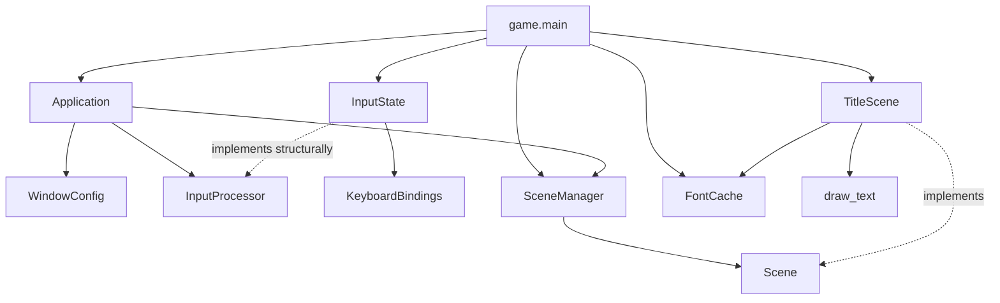

# Architecture overview

## Purpose

My First Adventure Game has two related goals:

1. build a small reusable engine for top-down 2D games with Pygame;
2. build a complete game that exercises the engine through real requirements.

The engine is internal to the repository. It is specialized for small adventure
games and is not intended to be a universal game engine.

## Fundamental separation

The source code is divided into two main areas:

### `engine`

Provides reusable technical capabilities independent of game rules and
content.

The engine must not know:

- concrete game actions;
- player profiles or statistics;
- scoring rules;
- game text or localization keys;
- game colors or artistic direction;
- concrete levels, entities, or combat rules.

### `game`

Defines the concrete application assembled from engine capabilities.

The game owns:

- concrete actions and default controls;
- scenes specific to the game;
- visual presentation;
- entities and levels;
- scoring and progression;
- localization;
- profile data and gameplay rules.

The dependency direction is always:

```text
game → engine
```

The engine must never import the game.

## Implemented domains

### Application

Owns the Pygame lifecycle, window creation, frame timing, event dispatch, scene
updates, rendering, and shutdown.

### Scenes

Defines the scene contract and manages the active scene.

A scene represents a global application state, such as a title screen,
gameplay, pause, results, or profile.

A map represents spatial content loaded by a gameplay scene. A map is not a
scene.

### Input

Converts device events into game-independent action states.

The engine tracks whether an action was pressed, held, or released during the
current frame. Concrete action names and default keys belong to the game.

### Assets

Loads and caches Pygame images and fonts stored in Python packages.

The engine owns package-based loading and caching. Concrete resource files,
paths, sizes, themes, and presentation decisions belong to the game.

### Graphics

Provides small tested drawing operations without owning game presentation
rules.

The current implementation renders centered antialiased text and returns its
destination rectangle.

### Collisions

Provides immutable floating-point axis-aligned bounds and positive-area overlap
detection.

The engine reports geometric overlap. The game decides its consequences.

### World

Provides lightweight entities with stable identity, floating-point geometry,
active state, immutable collision bounds, and deterministic lookup.

Concrete entity types and behavior belong to the game.

## Reserved domains

The package skeleton also reserves locations for capabilities that have not yet
been implemented:

- persistence;
- game entities;
- levels;
- scoring;
- profiles;
- localization.

Reserved packages communicate intended organization, not completed features.

## Runtime composition

The game entry point creates the concrete objects and connects them together.


`game.main` configures `FontCache` with Pygame's resource package.
`TitleScene`
loads the selected font lazily during drawing, after the application has
initialized Pygame.

## Main frame flow

For every frame, the application:

1. calculates delta time in seconds;
2. clears transient input states;
3. processes Pygame events;
4. updates the input processor before forwarding ordinary events to the scene;
5. updates the active scene;
6. asks the active scene to draw;
7. presents the completed frame.

The application handles the system-level quit event itself. It does not
interpret game actions.

## Design principle

The engine provides capabilities and reports facts. The game defines meaning
and consequences.

Current example:

- the engine reports that an action is held;
- the game decides whether that action should move a player, navigate a menu,
  or trigger another behavior.

As future domains are implemented, the same principle will apply:

- the engine will detect a collision;
- the game will decide whether it blocks movement, causes damage, or triggers
  an interaction;
- the engine will provide generic storage capabilities;
- the game will define profile schemas, statistics, and migration rules.