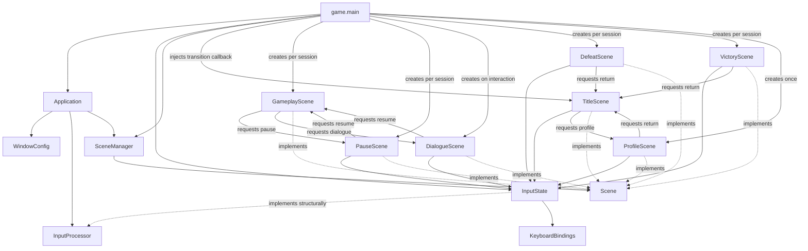
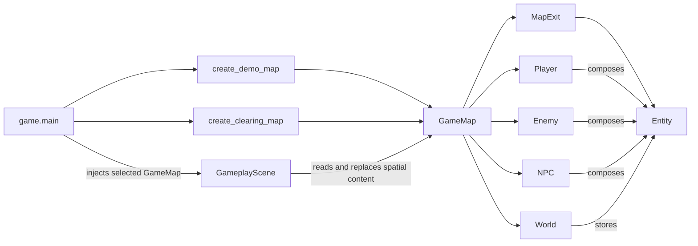
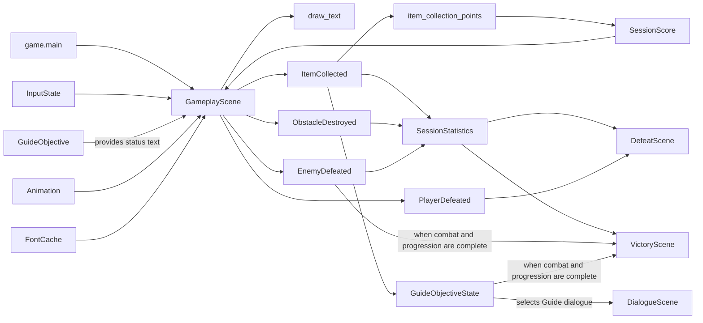

# Architecture overview

## Purpose

My First Adventure Game has two related goals:

1. build a small reusable engine for top-down 2D games with Pygame;
2. build a complete game that exercises the engine through real requirements.

The engine is internal to the repository. It is specialized for small adventure
games and is not intended to be a universal game engine.

## Fundamental separation

The source code is divided into two main areas:

### `engine`

Provides reusable technical capabilities independent of game rules and
content.

The engine must not know:

- concrete game actions;
- player profiles or statistics;
- scoring rules;
- game text or localization keys;
- game colors or artistic direction;
- concrete levels, entities, or combat rules.

### `game`

Defines the concrete application assembled from engine capabilities.

The game owns:

- concrete actions and default controls;
- scenes specific to the game;
- visual presentation;
- entities and levels;
- scoring and progression;
- localization;
- profile data and gameplay rules.

The dependency direction is always:

```text
game → engine
```

The engine must never import the game.

## Implemented domains

### Application

Owns the Pygame lifecycle, window creation, frame timing, event dispatch, scene
updates, rendering, and shutdown.

### Scenes

Defines the scene contract and manages the active scene.

A scene represents a global application state, such as a title screen,
gameplay, pause, results, or profile.

A map represents spatial content loaded by a gameplay scene. A map is not a
scene.

### Input

Converts device events into game-independent action states.

The engine tracks whether an action was pressed, held, or released during the
current frame. Concrete action names and default keys belong to the game.

### Assets

Loads and caches Pygame images and fonts stored in Python packages.

The engine owns package-based loading and caching. Concrete resource files,
paths, sizes, themes, and presentation decisions belong to the game.

### Graphics

Provides small tested drawing operations without owning game presentation
rules.

The current implementation renders centered antialiased text, returns its
destination rectangle, and advances looping or one-shot image-frame animations
using elapsed time.

### Collisions

Provides immutable floating-point axis-aligned bounds and positive-area overlap
detection.

The engine reports geometric overlap. The game decides its consequences.

### World

Provides lightweight entities with stable identity, floating-point geometry,
active state, deterministic lookup, and axis-separated movement against
immutable collision bounds.

It also calculates normalized movement toward a target while capping travel at
the target or a caller-supplied maximum distance. Concrete behavior still owns
the target, speed, timing, and obstacle selection.

Concrete entity types, solid obstacle selection, and behavior belong to the
game.

### Persistence

Provides UTF-8 JSON loading and atomic file replacement without knowing the
schema, storage location, or recovery policy of concrete game data.

## Implemented game foundations

### Entities

Defines concrete gameplay objects that compose reusable engine entities.

The current `Enemy` and `Player` own mutable integer health, apply positive
damage, deactivate their spatial entities on the fatal hit, and report whether
that hit caused the defeat. `NPC` composes the same reusable spatial state with
a game-owned display name, ordered dialogue lines, and an optional fixed
position or live entity movement target. The two target forms are mutually
exclusive. The gameplay scene advances configured NPCs against selected solid
bounds and reads live target positions each frame, but performs no pathfinding.

### Events

Defines immutable facts produced by concrete gameplay behavior.

The current `ItemCollected`, `ObstacleDestroyed`, `EnemyDefeated`, and
`PlayerDefeated` events identify concrete gameplay facts without deciding their
consequences.

### Scoring

Defines concrete game-owned point rules and the mutable score for the current
session.

An item collection currently awards 100 points. `game.main` converts each
`ItemCollected` fact into points, accumulates them in `SessionScore`, and shares
that score with `GameplayScene` for display. Validating the ready Guide
objective awards a fixed 500-point bonus exactly once.

### Statistics

Tracks concrete factual counters for the current game session independently
from its score.

`game.main` records collected items, destroyed obstacles, and defeated enemies
in one session-local `SessionStatistics`. Victory and defeat scenes read that
same object to display a final activity summary. Starting a new game creates
fresh counters. On completion, `PlayerProfile` copies their values into its
persistent cross-session totals rather than reusing the session object.

### Progression

Owns the session-local state, required and collected item counts, and status
text of the Guide's concrete collection objective.

The objective starts before activation, becomes active after the first Guide
interaction, becomes ready after every requested item is collected, and is
completed when the player returns to the Guide. The transitions remain
game-owned: `GuideObjective` records them, while `game.main` decides when they
occur and what they change in the world. `GameplayScene` only reads the current
status for display. This is not a generic engine quest system.

### Profile

Stores versioned, validated statistics accumulated across game sessions.

`game.main` loads one `PlayerProfile` from the platform-specific application
data directory, records each session start, and aggregates a completed
session's final score and factual statistics exactly once on victory or defeat.
Invalid or unreadable data falls back to an empty profile, while save failures
are logged without stopping the game.

### Scenes

Provides the concrete title, gameplay, pause, dialogue, profile, defeat, and
victory scenes.

The title scene requests an explicit transition to gameplay when the
confirmation action is pressed or to the persistent profile when the profile
action is pressed.

The profile scene displays every accumulated profile counter and explicitly
returns to the title on confirmation. It observes the already loaded profile
without owning persistence.

The gameplay scene converts game actions into player movement, selects active
walls, enemies, and NPCs as solid obstacles, opens dialogue for a nearby active
NPC when interaction is requested, deactivates collectibles overlapping the
player, destroys nearby destructible obstacles and defeats nearby enemies when
attacking, reports wall-blocked movement, emits factual events,
prioritizes one-shot collection and attack animations over movement and idle
presentation, applies contact damage with temporary player invulnerability,
and displays the current session score and player health.

The defeat scene displays the final session score and factual session counters
after player defeat, then requests an explicit return to the title when
confirmation is pressed. Starting again constructs a fresh session rather than
resetting the previous objects.

The victory scene displays the final session score and factual session counters
after every demo enemy is inactive and the Guide objective is completed. It
provides the same explicit return to the title.

The opaque pause scene temporarily replaces gameplay when Escape is pressed.
Because only the active scene is updated, gameplay time and animation stop. A
second press explicitly restores the same gameplay scene and session state.

The opaque dialogue scene presents the selected NPC's name and ordered lines
one at a time inside a game-owned bordered panel. Long content is measured with
the selected font, wrapped at word boundaries, and given additional panel
height without changing the original NPC line. Confirmation advances the
dialogue, then explicitly restores the same gameplay scene and session state
after the final line.

The clearing's Caretaker is the first autonomous NPC consumer. It initially
follows one map-authored diagonal destination at a fixed speed. Touching a
clearing wall makes the shared player entity its live target, so the Caretaker
continues pursuing the player's current position. That target persists through
map changes until the Caretaker reaches interaction range. The gameplay scene
then reports the factual arrival, and the composition root clears the target
before opening a dedicated warning dialogue. Collision movement may slide along
one free axis, but it does not plan a route around obstacles. Returning to the
wall and cleaning it are not implemented yet.

### Levels

Defines the current Python-authored game maps and their spatial connections.

`GameMap` groups a stable identifier, game-owned background color, and reusable
world representation with the concrete player, wall, enemy, NPC, destructible
obstacle, collectible, and exit roles owned by the game. `MapExit` associates a
spatial trigger with a concrete destination identifier and arrival position.
`create_demo_map()` and `create_clearing_map()` define the current layouts,
background colors, and registration order.

## Reserved domains

The package skeleton also reserves locations for capabilities that have not yet
been implemented:

- localization.

Reserved packages communicate intended organization, not completed features.

## Runtime composition

The game entry point creates the concrete objects and connects them together.
The composition is split below into three focused views so that each diagram
answers one architectural question.

### Application and scene composition



### Gameplay map composition



### Gameplay collaborators and facts



`game.main` creates the demo and clearing maps around the same player, the
current `SessionScore`, temporary two-frame idle, movement, collection, and
attack animations, and a `GuideObjective` only after the title scene requests
a new game, then composes `GameplayScene` from the complete demo `GameMap`,
shared rendering services, score, objective, animations, and explicit gameplay
handlers. The scene applies that initial map through the same `change_map()`
path used for later navigation.
`GameplayScene`
selects idle or
movement presentation from directional intent, gives one-shot collection
presentation priority until completion, advances and renders the selected
animation, and delivers an `ItemCollected` fact when an active collectible is
collected. A newly pressed attack deactivates a nearby active destructible
obstacle, removes it from later collision and rendering, and delivers an
`ObstacleDestroyed` fact. The same input starts a one-shot attack presentation
that has priority over movement and idle animation. An active enemy within the
same attack reach takes one point of damage. The current enemy survives the
first hit and briefly flashes with a game-owned feedback color. The second hit
deactivates its spatial entity, removes it from later collision and rendering,
and reports an `EnemyDefeated` fact.

After movement, `GameplayScene` detects overlap with active exits and reports
the selected `MapExit` to the composition root. The root resolves either the
demo or clearing map, applies the exit's arrival position to their shared
player, and calls `GameplayScene.change_map()`. This replaces only map-owned
spatial roles, enemy timers, and the rendered background color; the gameplay
scene, score, objective, and session callbacks remain unchanged. Each concrete
map owns its color, so neither the scene nor the engine defines a map theme. The
`SceneManager` is not involved.

The enemy defeat handler inspects the remaining demo enemies after each factual
event. It explicitly replaces gameplay with `VictoryScene` only when all are
inactive and the Guide objective is completed. If combat finishes first,
closing the later Guide completion dialogue opens victory; if progression
finishes first, defeating the final enemy opens it immediately. This combined
completion rule belongs to the concrete game and may be replaced in a cloned
project.

Contact with an active enemy removes one point of player health and starts a
short invulnerability period that prevents immediate repeated damage. Fatal
contact deactivates the player, stops later gameplay updates, and reports a
`PlayerDefeated` fact. The injected handler explicitly replaces gameplay with
`DefeatScene`, which displays the final value of the shared `SessionScore` and
the factual counters from the shared `SessionStatistics`.

When `INTERACT` is newly pressed, `GameplayScene` searches a small game-owned
area around the player for the first active NPC. A match stops the rest of that
gameplay update and passes the selected NPC to the composition root. The root
creates a fresh `DialogueScene` from its name and ordered lines. The name
remains visible as the speaker while confirmation advances one line at a time
and restores the same gameplay scene after the final line. Reopening the
dialogue starts again from the first line because the temporary index belongs
to the scene instance. This remains a concrete linear interaction flow, not an
engine dialogue system.

Confirmation on `DefeatScene` explicitly returns to the existing title scene.
The next start request constructs new demo and clearing maps, session score,
session statistics, animation set, gameplay scene, pause scene, defeat scene,
victory scene, and session-local callbacks. Shared application services such as
input state, font cache, and scene manager remain alive.

The collection handler converts that fact through `item_collection_points()`
and adds the result to the same `SessionScore` displayed by `GameplayScene`.
It also records the fact in the session-local Guide objective. The objective
advances from active to ready when its collected count reaches the required
total supplied from the demo and clearing maps.

Objective collectibles initially remain inactive. The first Guide interaction
activates them and presents the NPC's introductory lines. Further interactions
before collection finishes use a game-owned reminder. Returning after every
item is collected selects a completion message and makes the completed result
stable for later interactions. This is a concrete progression rule assembled
in `game.main`, not a reusable quest or dialogue-condition system.
The gameplay HUD reads the same objective instance and displays its current
game-owned status text without owning any transition rule. While collection is
active, that text includes the live collected and required item counts.
The ready-to-completed interaction also applies the game-owned objective bonus
to the shared session score. Reopening completed dialogue does not apply it
again.

`game.main` also injects separate callbacks into `TitleScene` that explicitly
replace the active scene when confirmation or profile navigation is pressed.
It creates one `ProfileScene` around the loaded mutable profile, so later visits
observe results aggregated during the same application run. The shared
`FontCache` supplies fonts lazily during drawing after Pygame initialization.

## Main frame flow

For every frame, the application:

1. calculates delta time in seconds;
2. clears transient input states;
3. processes Pygame events;
4. updates the input processor before forwarding ordinary events to the scene;
5. updates the active scene;
6. asks the active scene to draw;
7. presents the completed frame.

The application handles the system-level quit event itself. It does not
interpret game actions.

## Design principle

The engine provides capabilities and reports facts. The game defines meaning
and consequences.

Current example:

- the engine reports that an action is held;
- the game decides whether that action should move a player, navigate a menu,
  or trigger another behavior.

As future domains are implemented, the same principle will apply:

- the engine will detect a collision;
- the game will decide whether it blocks movement, causes damage, or triggers
  an interaction;
- the engine will provide generic storage capabilities;
- the game will define profile schemas, statistics, and migration rules.
