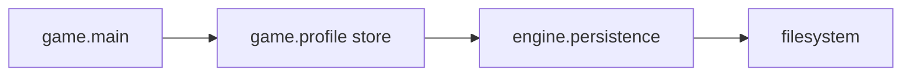

# Persistence domain

## Responsibility

The engine persistence domain provides small, game-independent JSON file
operations.

It currently provides:

- `load_json()`, which decodes a UTF-8 JSON file;
- `save_json_atomic()`, which serializes JSON beside the destination and then
  atomically replaces it.

It does not choose storage locations, define schemas, validate game data, or
decide how read and write failures affect the application.

## Why this domain exists

Persistent game data needs a reusable filesystem mechanism without moving
profile rules into the engine. Keeping JSON I/O here allows the game to own the
meaning and lifetime of its data while sharing a narrowly scoped, testable
storage operation.

## Public components

### [`load_json`](../api/persistence.md#my_first_adventure_game.engine.persistence.load_json)

Reads one UTF-8 file and returns its decoded JSON value. Filesystem, Unicode,
and JSON decoding errors are propagated so the caller can choose a policy.

### [`save_json_atomic`](../api/persistence.md#my_first_adventure_game.engine.persistence.save_json_atomic)

Creates missing parent directories, writes formatted UTF-8 JSON to a temporary
file in the destination directory, and replaces the destination only after the
write succeeds. Errors are propagated to the caller.

## Ownership

Generic JSON file handling belongs to `engine` because it contains no concrete
profile fields, game statistics, scoring rules, or platform-specific
application identity.

Schemas, validation, storage paths, recovery policy, and the decision to save
belong to consumers such as `game.profile` and the composition root.

## Relationships

## Invariants

- JSON text is read and written as UTF-8.
- A save creates its parent directory when necessary.
- The temporary file is created on the destination filesystem.
- A failed replacement does not overwrite an existing destination.
- Temporary files are cleaned up after successful and failed saves when
  possible.
- Storage and decoding errors are not converted into game-specific results.

## Extension points

Additional reusable storage formats should be introduced only when a concrete
consumer requires them. Schema migration and backup policy should remain with
the data owner unless several independent consumers demonstrate a shared
mechanism.

## Change risks

- Adding profile fields or validation here would reverse the `game -> engine`
  dependency boundary.
- Writing temporary data on another filesystem could invalidate atomic
  replacement assumptions.
- Swallowing errors in the engine would prevent callers from applying their
  own recovery or reporting policy.
- Turning this domain into a speculative repository framework would add
  abstraction without a demonstrated requirement.

## Verification

Current tests verify UTF-8 loading, invalid and missing file error propagation,
parent creation, destination replacement, preservation of existing data after
a failed replacement, and temporary-file cleanup.
