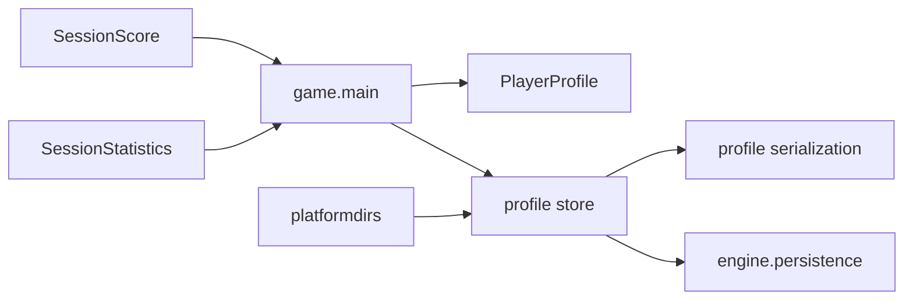

# Profile domain

## Responsibility

The game profile domain owns statistics accumulated across game sessions, their
versioned JSON representation, and the platform-specific profile location.

It records:

- games started and finished;
- victories;
- best and cumulative scores;
- collected items, destroyed obstacles, and defeated enemies from finished
  sessions.

## Why this domain exists

Session score and statistics disappear when a game ends. `PlayerProfile`
preserves selected long-term results without changing the responsibilities of
the session-local objects or introducing profile concepts into the engine.

## Public components

### [`PlayerProfile`](../api/game-profile.md#my_first_adventure_game.game.profile.PlayerProfile)

Stores mutable nonnegative counters across sessions. Starting a game increments
only `games_started`. Finishing one increments the completion counters,
optionally records a victory, updates the best score, and aggregates the final
score and activity statistics.

### [`profile_to_data`](../api/game-profile.md#my_first_adventure_game.game.profile.profile_to_data)

Converts a profile to the current versioned, JSON-compatible representation.

### [`profile_from_data`](../api/game-profile.md#my_first_adventure_game.game.profile.profile_from_data)

Builds a profile from supported and internally consistent data. Unsupported,
missing, negative, Boolean, or inconsistent counters produce an empty profile.

### [`get_profile_path`](../api/game-profile.md#my_first_adventure_game.game.profile.get_profile_path)

Returns the operating system's application-data location for `profile.json`
using the concrete game identity.

### [`load_profile`](../api/game-profile.md#my_first_adventure_game.game.profile.load_profile)

Loads and validates a profile. Missing, unreadable, incorrectly encoded, or
invalid JSON data produces an empty profile so startup can continue.

### [`save_profile`](../api/game-profile.md#my_first_adventure_game.game.profile.save_profile)

Serializes and atomically saves a profile. Write errors are propagated to the
composition root.

## Ownership

The profile belongs to `game` because its fields, aggregation rules,
application identity, compatibility version, and recovery behavior are
concrete product decisions.

The engine supplies only generic JSON storage and never imports this domain.

## Relationships

`game.main` loads one profile at application startup. It records and saves a
session start when the title scene starts a game. Victory and defeat both pass
the final session score and statistics to one guarded completion operation, so
the same session cannot be aggregated twice. Save failures are logged and do
not stop scene transitions or gameplay.

## Invariants

- Every counter is an exact nonnegative integer; Boolean values are rejected.
- Finished games cannot exceed started games.
- Victories cannot exceed finished games.
- Best score cannot exceed cumulative score.
- Only finished sessions contribute score and activity totals.
- One session is recorded as finished at most once.
- Unsupported or invalid persisted data falls back to an empty profile.
- A write failure does not terminate the game.

## Extension points

A later profile scene may display the persisted values without changing their
storage contract. Schema evolution should increment the profile version and
define an explicit compatibility or migration policy.

Additional long-term fields should be added only when a concrete game feature
consumes them.

## Change risks

- Persisting `SessionScore` or `SessionStatistics` directly would blur session
  and profile lifetimes.
- Recording completion in result scenes would couple presentation to durable
  state and risk duplicate aggregation.
- Treating malformed data as partially trustworthy could violate relationships
  between counters.
- Moving profile policy into `engine` would make cloned games inherit concrete
  statistics and scoring decisions.

## Verification

Current tests verify defaults, session-start and completion aggregation,
victories, best and cumulative scores, serialization, strict validation,
fallback loading, platform-specific path construction, atomic-save delegation,
write-error propagation, single application startup loading, per-session saves,
duplicate-completion protection, and nonfatal save logging.
