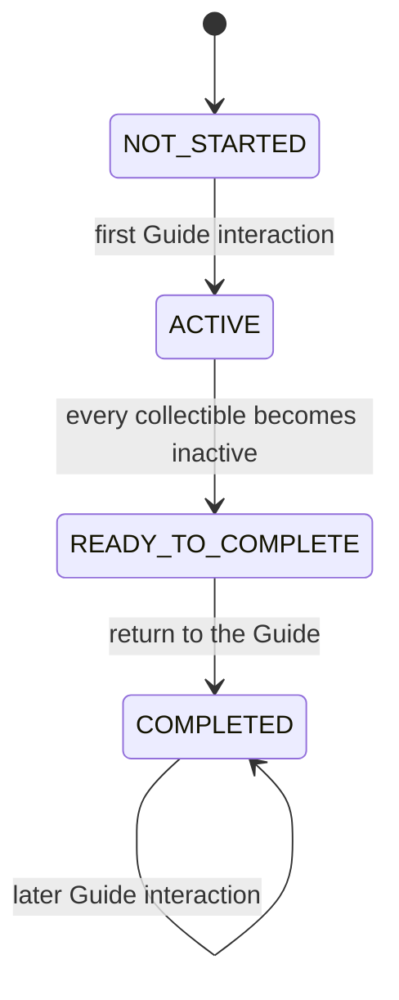

# Progression domain

## Responsibility

The game progression domain names the states of the Guide's concrete collection
objective.

It currently exposes `GuideObjectiveState`, whose ordered states are:

1. `NOT_STARTED` before the player first speaks to the Guide;
2. `ACTIVE` while the requested collectibles are available;
3. `READY_TO_COMPLETE` after every requested collectible has been collected;
4. `COMPLETED` after the player returns to the Guide.

The transitions and their gameplay consequences are composed in `game.main`.
This domain does not provide a generic quest system.

## Why this domain exists

The collection objective now has a lifecycle that cannot be inferred safely
from collectible activity alone. Before the first interaction, every objective
collectible is inactive, but the objective has not been completed.

An explicit state distinguishes that initial condition from completion and
makes the concrete progression rule readable without moving game policy into
the engine.

## Public components

### [`GuideObjectiveState`](../api/game-progression.md#my_first_adventure_game.game.progression.GuideObjectiveState)

Names the four states of the Guide's collection objective.

The enum carries no transition logic. `game.main` owns the session-local state
and changes it in response to NPC interaction and item collection.

## Ownership

Progression belongs to `game` because objective content, activation rules,
completion conditions, and dialogue consequences are concrete game policy.

The engine does not import progression components, know what the Guide asks
for, or decide when an objective is complete.

## Relationships

`game.main` creates a fresh state for every new game. The first Guide
interaction activates the map collectibles and uses the NPC's introductory
lines. Later interactions while the objective is active use a reminder. The
collection handler marks the objective ready only after every collectible is
inactive. Returning to the Guide then selects the completion message and makes
that result stable for later interactions.

## Invariants

- Every new game starts in `NOT_STARTED`.
- Objective collectibles remain inactive until the first Guide interaction.
- The first Guide interaction activates the objective collectibles.
- Collecting every objective item changes `ACTIVE` to `READY_TO_COMPLETE`.
- Only a later Guide interaction changes `READY_TO_COMPLETE` to `COMPLETED`.
- Later Guide interactions keep the objective completed.
- Starting another game creates an independent objective state.
- The engine does not depend on game progression.

## Extension points

Future concrete objectives may introduce their own state and orchestration when
a demonstrated gameplay requirement needs them.

A reusable quest model should only be considered after multiple objectives
reveal shared mechanics that can be separated from their content and rules.

## Change risks

- Inferring completion only from inactive collectibles confuses an objective
  that has not started with one that has been completed.
- Moving the Guide's objective into `engine` would leak concrete progression
  policy into a reusable mechanism.
- Making `GameplayScene` select objective dialogue would couple spatial
  interaction to progression content.
- Introducing a generic quest graph, condition language, or event bus for this
  single objective would create unsupported abstraction.

## Verification

Current tests verify:

- the four states have the expected order;
- demo-map objective collectibles start inactive;
- the first Guide interaction activates them and uses introductory dialogue;
- interaction during collection uses the active-objective reminder;
- collecting every item makes the completion dialogue available;
- later interactions preserve the completed result.
