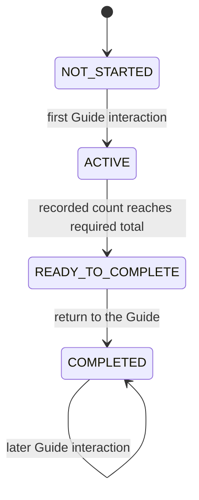

# Progression domain

## Responsibility

The game progression domain names the states of the Guide's concrete collection
objective.

It currently exposes:

- `GuideObjective`, which owns the session-local state, its explicit
  transitions, required and collected item counts, and the concrete status text
  shown during gameplay;
- `GuideObjectiveState`, whose ordered states are:

1. `NOT_STARTED` before the player first speaks to the Guide;
2. `ACTIVE` while the requested collectibles are available;
3. `READY_TO_COMPLETE` after every requested collectible has been collected;
4. `COMPLETED` after the player returns to the Guide.

`GuideObjective` owns the transitions. Their gameplay consequences remain
composed in `game.main`. This domain does not provide a generic quest system.

## Why this domain exists

The collection objective now has a lifecycle that cannot be inferred safely
from collectible activity alone. Before the first interaction, every objective
collectible is inactive, but the objective has not been completed.

An explicit state distinguishes that initial condition from completion and
makes the concrete progression rule readable without moving game policy into
the engine.

## Public components

### [`GuideObjective`](../api/game-progression.md#my_first_adventure_game.game.progression.GuideObjective)

Tracks one Guide collection objective for the current game session.

It starts in `NOT_STARTED` with zero collected items and a required total
provided by the composition root. Its `start()` and `complete()` methods perform
explicit state changes. `record_item_collected()` increments progress and marks
the objective ready when the count reaches the required total. The read-only
`state`, `total_items`, and `collected_items` expose current progress, while
`status_text` provides the concrete game-owned text displayed by
`GameplayScene`.

### [`GuideObjectiveState`](../api/game-progression.md#my_first_adventure_game.game.progression.GuideObjectiveState)

Names the four states of the Guide's collection objective.

The enum carries no transition logic. `GuideObjective` owns the session-local
state and changes it when instructed by `game.main` after NPC interaction or
item collection.

## Ownership

Progression belongs to `game` because objective content, activation rules,
completion conditions, and dialogue consequences are concrete game policy.

The engine does not import progression components, know what the Guide asks
for, or decide when an objective is complete.

## Relationships

`game.main` creates a fresh `GuideObjective` for every new game and injects the
same instance into `GameplayScene`. The scene reads `status_text` for display
without changing progression. The first Guide interaction activates the
objective collectibles across the demo and clearing maps and uses the NPC's
introductory lines. Later interactions while the objective is active use a
reminder. The collection handler records each `ItemCollected` fact regardless
of the active map. The objective marks itself ready when the recorded count
reaches the combined total supplied by the composition root.
Returning to the Guide then selects the completion message and makes that result
stable for later interactions. That validation also awards the game-owned
completion bonus exactly once. Victory requires this completed state and every
demo enemy to be inactive. Whichever condition is satisfied last triggers the
result transition; when Guide validation is last, the completion dialogue
closes into victory.

## Invariants

- Every new game starts in `NOT_STARTED`.
- Every new objective starts with zero collected items.
- The required total equals the number of objective collectibles across that
  session's demo and clearing maps.
- Objective collectibles remain inactive until the first Guide interaction.
- The first Guide interaction activates the objective collectibles on both
  maps.
- Each reported collection increments the objective count once.
- Reaching the required total changes `ACTIVE` to `READY_TO_COMPLETE`.
- Only a later Guide interaction changes `READY_TO_COMPLETE` to `COMPLETED`.
- That transition awards the completion bonus once.
- Victory requires both `COMPLETED` progression and every demo enemy to be
  inactive.
- Completing either requirement first does not bypass the other.
- Later Guide interactions keep the objective completed.
- Starting another game creates an independent objective state.
- The active status text displays collected and required item counts.
- Every other state has one stable game-owned status text.
- `GameplayScene` observes the objective but does not perform its transitions.
- The engine does not depend on game progression.

## Extension points

Future concrete objectives may introduce their own state and orchestration when
a demonstrated gameplay requirement needs them.

A reusable quest model should only be considered after multiple objectives
reveal shared mechanics that can be separated from their content and rules.

## Change risks

- Inferring completion only from inactive collectibles confuses an objective
  that has not started with one that has been completed.
- Moving the Guide's objective into `engine` would leak concrete progression
  policy into a reusable mechanism.
- Making `GameplayScene` select objective dialogue would couple spatial
  interaction to progression content.
- Recording the same item event more than once would overcount progress; the
  gameplay event contract must continue to deliver collection once per item.
- Introducing a generic quest graph, condition language, or event bus for this
  single objective would create unsupported abstraction.

## Verification

Current tests verify:

- the four states have the expected order;
- demo and clearing objective collectibles start inactive;
- the first Guide interaction activates them across both maps and uses
  introductory dialogue;
- collections before and after a map change advance the same objective;
- interaction during collection uses the active-objective reminder;
- collecting every item makes the completion dialogue available;
- later interactions preserve the completed result.
- victory remains blocked until combat and Guide progression are both complete,
  in either order;
- a new objective exposes the supplied total and starts at zero;
- recording collection increments the count and reaching the total marks the
  objective ready;
- active status text reports live collected and required counts;
- other states expose the expected status text;
- runtime composition gives each gameplay session its own objective;
- gameplay rendering displays the current objective text.
