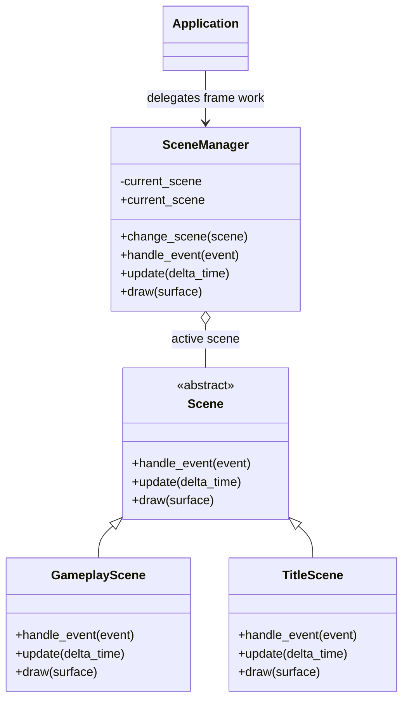

# Scenes domain

## Responsibility

The scenes domain represents global application states and manages which state
is currently active.

It is responsible for:

- defining the contract implemented by every scene;
- storing the active scene;
- replacing the active scene explicitly;
- forwarding events, updates, and drawing calls to the active scene.

It does not define concrete game screens or navigation rules.

## Why this domain exists

A Pygame application needs different global states such as title, gameplay,
pause, results, and profile screens.

Without a scene abstraction, the application loop would need to know every
concrete state and contain game-specific navigation logic.

The scene manager keeps the application independent from concrete scenes while
providing one explicit transition mechanism.

## Public components

### [`Scene`](../api/scenes.md#my_first_adventure_game.engine.scenes.Scene)

Defines the required behavior of a scene.

Every concrete scene must implement:

- `handle_event(event)`;
- `update(delta_time)`;
- `draw(surface)`.

Depends on:

- Pygame event and surface types.

Does not know:

- `Application`;
- `SceneManager`;
- input bindings;
- game themes;
- map formats;
- navigation rules.

A concrete scene may receive selected collaborators through its constructor
when its behavior requires them.

### [`SceneManager`](../api/scenes.md#my_first_adventure_game.engine.scenes.SceneManager)

Stores and delegates to the active scene.

Created by:

- `game.main`.

Used by:

- `Application`;
- the game-owned navigation callback composed in `game.main`.

Depends on:

- `Scene`;
- Pygame event and surface types.

## Relationships



`TitleScene` and `GameplayScene` belong to `game`, even though they implement
the engine-owned `Scene` contract.

## Transition semantics

A scene manager is created with an initial scene.

It never has an intentionally empty state.

Calling `change_scene(scene)` immediately replaces the active scene. Subsequent
manager operations target the replacement.

Transitions are explicit. The application does not infer them from event types,
scene return values, or map changes.

## Scene lifecycle

The current contract has no `on_enter()` or `on_exit()` methods.

They must not be added until a concrete scene needs lifecycle behavior that
cannot be expressed clearly through its existing collaborators.

If lifecycle methods are introduced later, their ordering and failure behavior
must be documented and tested.

The current manager also has no scene stack. Pause behavior must provide a real
requirement before stack operations such as push and pop are considered.

## Scenes versus maps

A scene represents a global application state.

Examples include:

- title;
- gameplay;
- pause;
- results;
- profile.

A map represents spatial content loaded and managed inside a gameplay scene.

Changing maps must not automatically replace the gameplay scene.

This separation allows one gameplay scene to preserve session state while the
player moves between maps.

## Game integration

The current game provides
[`TitleScene`](../api/game-scenes.md#my_first_adventure_game.game.scenes.TitleScene)
and
[`GameplayScene`](../api/game-scenes.md#my_first_adventure_game.game.scenes.GameplayScene).

`TitleScene`:

- ignores events;
- queries the action input state during updates;
- draws the game-owned background and centered title;
- loads its selected font lazily through `FontCache`;
- requests gameplay through an injected callback when `CONFIRM` is pressed.

`GameplayScene`:

- receives the action input state, font cache, session score, player entity,
  wall entities, destructible obstacles, collectible entities, idle, movement,
  collection, and attack animations, and explicit collection and destruction
  handlers;
- converts directional actions into normalized movement;
- selects the movement animation while the directional axis is non-zero and
  the idle animation otherwise;
- resets the newly selected animation when the movement state changes;
- advances only the selected player animation using frame delta time;
- applies the game-owned movement speed using delta time;
- selects wall bounds as solid obstacles;
- delegates collision-aware movement to the engine;
- applies a game-owned proximity attack when `ATTACK` is pressed;
- restarts a one-shot attack animation when the attack begins and gives it
  priority over idle and movement presentation;
- deactivates the first active destructible obstacle within attack reach and
  delivers an immutable `ObstacleDestroyed` fact;
- detects player overlap with active collectibles after movement;
- applies the game-owned collection rule by deactivating overlapping
  collectibles;
- delivers an immutable `ItemCollected` fact after deactivation;
- restarts the one-shot collection animation when an item is collected and
  gives it priority over idle and movement presentation;
- returns to the animation selected by directional intent after collection
  playback finishes;
- draws active walls and active collectibles as game-owned rectangles, blits the
  current player animation frame, and draws the current session score;
- rounds floating-point geometry only at rendering time.

`game.main` composes `GameplayScene` from the shared font cache and session
score, the player, walls, destructible obstacles, and collectibles provided by
the demo map, idle, movement, collection, and attack animations, and explicit
collection and destruction handlers. The collection handler applies the
game-owned collection point rule to the same session score displayed by the
scene. The destruction handler currently has no additional consequence.

The current idle, movement, collection, and attack animations each use two
game-owned colored surfaces as temporary frames. This validates animation
timing, state selection, reset and completion behavior, and rendering without
treating those placeholder visuals as engine defaults.

Animation priority is:

```text
collection > attack > movement > idle
```

Collection presentation does not block movement. It is a temporary visual
state that finishes automatically.

Attack presentation also does not block movement. A collection beginning on
the same frame takes visual priority, while the attack's gameplay consequence
is still evaluated.

Movement animation follows directional intent rather than collision-resolved
displacement. Holding a direction against a wall therefore continues to show
movement, which is a concrete presentation rule owned by the game.

## Invariants

- A scene manager always has an active scene after construction.
- Events are forwarded only to the currently active scene.
- Updates are forwarded only to the currently active scene.
- Drawing is forwarded only to the currently active scene.
- A transition replaces the active scene explicitly.
- The scenes domain never imports concrete game scenes.
- Map transitions are not scene transitions by default.

## Extension points

Future requirements may justify:

- scene entry and exit lifecycle methods;
- transition effects;
- a pause-oriented scene stack;
- deferred transitions at frame boundaries;
- scene factories when construction requires several services.

These extensions must remain independent from concrete game navigation.

Methods such as `show_title()`, `start_game()`, or `show_results()` do not
belong on the engine application or scene manager.

## Change risks

High-risk modifications include:

- allowing the manager to have no active scene;
- coupling `Scene` to `Application`;
- adding game-specific navigation methods;
- treating every map as a scene;
- changing transitions from immediate to deferred without updating callers;
- introducing lifecycle hooks without defining their order;
- forwarding work to more than one scene unintentionally.

## Verification

Current tests verify:

- the initial scene becomes active;
- an explicit transition replaces the active scene;
- events are delegated to the active scene;
- updates are delegated with delta time;
- drawing is delegated with the target surface;
- the concrete title scene draws its background and centered title;
- the gameplay scene delegates movement with game actions, speed, and walls;
- the gameplay scene selects, resets, advances, and draws its injected idle,
  movement, and collection animations;
- the collection animation takes priority until completion before returning to
  the state selected by directional input;
- the attack animation starts on a newly pressed attack, remains selected until
  completion, and then returns to the state selected by directional input;
- the gameplay scene draws its background, walls, active collectibles, and
  animated player in order;
- the gameplay scene deactivates an active overlapping collectible and delivers
  its event exactly once across subsequent updates while leaving distant
  collectibles active;
- the gameplay scene destroys a nearby active destructible obstacle only when
  attack is newly pressed and delivers its event exactly once;
- inactive destroyed obstacles are excluded from collision and rendering while
  ordinary walls remain unaffected;
- the gameplay scene loads its score font and draws the current session score;
- the title scene requests gameplay only when confirmation is pressed;
- the composition root connects the demo map and explicit title-to-gameplay
  transition.
