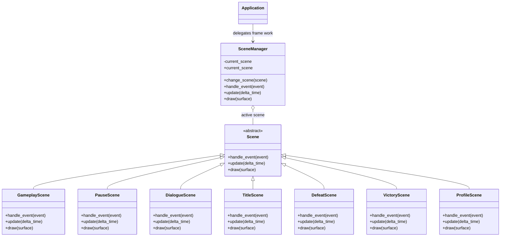

# Scenes domain

## Responsibility

The scenes domain represents global application states and manages which state
is currently active.

It is responsible for:

- defining the contract implemented by every scene;
- storing the active scene;
- replacing the active scene explicitly;
- forwarding events, updates, and drawing calls to the active scene.

It does not define concrete game screens or navigation rules.

## Why this domain exists

A Pygame application needs different global states such as title, gameplay,
pause, results, and profile screens.

Without a scene abstraction, the application loop would need to know every
concrete state and contain game-specific navigation logic.

The scene manager keeps the application independent from concrete scenes while
providing one explicit transition mechanism.

## Public components

### [`Scene`](../api/scenes.md#my_first_adventure_game.engine.scenes.Scene)

Defines the required behavior of a scene.

Every concrete scene must implement:

- `handle_event(event)`;
- `update(delta_time)`;
- `draw(surface)`.

Depends on:

- Pygame event and surface types.

Does not know:

- `Application`;
- `SceneManager`;
- input bindings;
- game themes;
- map formats;
- navigation rules.

A concrete scene may receive selected collaborators through its constructor
when its behavior requires them.

### [`SceneManager`](../api/scenes.md#my_first_adventure_game.engine.scenes.SceneManager)

Stores and delegates to the active scene.

Created by:

- `game.main`.

Used by:

- `Application`;
- the game-owned navigation callback composed in `game.main`.

Depends on:

- `Scene`;
- Pygame event and surface types.

## Relationships



The concrete title, gameplay, pause, and result scenes belong to `game`, even
though they implement the engine-owned `Scene` contract.

## Transition semantics

A scene manager is created with an initial scene.

It never has an intentionally empty state.

Calling `change_scene(scene)` immediately replaces the active scene. Subsequent
manager operations target the replacement.

Transitions are explicit. The application does not infer them from event types,
scene return values, or map changes.

## Scene lifecycle

The current contract has no `on_enter()` or `on_exit()` methods.

They must not be added until a concrete scene needs lifecycle behavior that
cannot be expressed clearly through its existing collaborators.

If lifecycle methods are introduced later, their ordering and failure behavior
must be documented and tested.

The current manager has no scene stack. The concrete pause requirement is met
by explicitly replacing gameplay with a session-owned opaque `PauseScene`, then
restoring that same gameplay scene. Stack operations such as push and pop remain
unnecessary until another requirement needs nested or overlaid scenes.

## Scenes versus maps

A scene represents a global application state.

Examples include:

- title;
- gameplay;
- pause;
- results;
- profile.

A map represents spatial content loaded and managed inside a gameplay scene.

Changing maps must not automatically replace the gameplay scene.

This separation allows one gameplay scene to preserve session state while the
player moves between maps.

## Game integration

The current game provides
[`TitleScene`](../api/game-scenes.md#my_first_adventure_game.game.scenes.TitleScene)
and
[`GameplayScene`](../api/game-scenes.md#my_first_adventure_game.game.scenes.GameplayScene).
The game also provides
[`DefeatScene`](../api/game-scenes.md#my_first_adventure_game.game.scenes.DefeatScene).
The game also provides
[`VictoryScene`](../api/game-scenes.md#my_first_adventure_game.game.scenes.VictoryScene).
It also provides
[`PauseScene`](../api/game-scenes.md#my_first_adventure_game.game.scenes.PauseScene)
and
[`DialogueScene`](../api/game-scenes.md#my_first_adventure_game.game.scenes.DialogueScene).
It also provides
[`ProfileScene`](../api/game-scenes.md#my_first_adventure_game.game.scenes.ProfileScene).

`TitleScene`:

- ignores events;
- queries the action input state during updates;
- draws the game-owned background and centered title;
- loads its selected font lazily through `FontCache`;
- displays explicit instructions for starting and viewing the profile;
- requests gameplay through an injected callback when `CONFIRM` is pressed;
- requests the profile through a separate injected callback when
  `SHOW_PROFILE` is pressed;
- gives confirmation priority when both navigation actions are pressed in the
  same frame.

`ProfileScene`:

- receives the shared font cache, loaded player profile, action input state,
  and an explicit return callback;
- displays games started, games finished, victories, best score, cumulative
  score, collected items, destroyed obstacles, and defeated enemies;
- reads the existing mutable profile without loading, saving, or changing it;
- requests a return to the title when `CONFIRM` is pressed;
- ignores raw events.

`GameplayScene`:

- receives the action input state, font cache, session score, game-owned player,
  wall entities, game-owned enemies and NPCs, destructible obstacles,
  collectible entities, idle, movement, collection, and attack animations, and
  explicit interaction, collection, destruction, enemy defeat, player defeat,
  wall contact, and NPC target arrival handlers, plus map exits and an explicit
  exit handler;
- requests pause and returns immediately when `PAUSE` is pressed, before any
  gameplay timer, movement, attack, damage, collection, or animation advances;
- converts directional actions into normalized movement;
- selects the movement animation while the directional axis is non-zero and
  the idle animation otherwise;
- resets the newly selected animation when the movement state changes;
- advances only the selected player animation using frame delta time;
- applies the game-owned movement speed using delta time;
- selects active wall, enemy, and NPC bounds as solid obstacles;
- delegates collision-aware movement to the engine;
- identifies an active wall that reduced requested player movement and delivers
  an immutable `WallTouched` fact containing the wall identifier, clamped
  surface point, and outward axis-aligned normal through its injected handler;
- does not report wall contact when another solid role, such as an NPC, blocks
  movement;
- moves each active NPC with a configured fixed position or live target entity
  using its game-owned speed and the frame delta time; fixed positions may
  carry an optional arrival identifier;
- reads a target entity's current position during every update rather than
  storing a position snapshot;
- reports `NPCTargetReached` when the moving NPC reaches interaction range of
  its live target, then stops that gameplay update because the handler may
  replace the active scene;
- reports the same factual event when a named fixed target is reached exactly,
  but not when collision blocks the NPC before that position;
- treats active walls, the player, enemies, and other NPCs as solid during NPC
  movement while excluding the moving NPC from its own obstacles;
- relies on axis-separated collision sliding and does not calculate paths or
  obstacle detours;
- detects overlap with active map exits after movement, reports the selected
  exit, and stops the old map's update immediately;
- replaces its player and map-owned spatial roles through `change_map()` while
  applying the selected map's background color and preserving the same gameplay
  scene, score, progression, callbacks, and presentation collaborators;
- finds the first active NPC within game-owned interaction reach when
  `INTERACT` is pressed, requests dialogue through an injected callback, and
  returns before the rest of that gameplay frame advances;
- applies a game-owned proximity attack when `ATTACK` is pressed;
- restarts a one-shot attack animation when the attack begins and gives it
  priority over idle and movement presentation;
- deactivates the first active destructible obstacle within attack reach and
  delivers an immutable `ObstacleDestroyed` fact;
- applies one point of game-owned damage to active enemies within attack reach
  and delivers immutable `EnemyDefeated` facts only after fatal hits;
- displays a brief game-owned color flash after non-fatal enemy damage and
  restores the normal enemy color when its scene-owned timer expires;
- applies one point of damage when the player contacts an active enemy and
  prevents repeated contact damage during a short invulnerability period;
- delivers an immutable `PlayerDefeated` fact after fatal contact damage and
  stops later gameplay updates while the player remains inactive;
- detects player overlap with active collectibles after movement;
- applies the game-owned collection rule by deactivating overlapping
  collectibles;
- delivers an immutable `ItemCollected` fact after deactivation;
- restarts the one-shot collection animation when an item is collected and
  gives it priority over idle and movement presentation;
- returns to the animation selected by directional intent after collection
  playback finishes;
- draws active walls, enemies, NPCs, collectibles, and map exits as game-owned
  rectangles, blits the current player animation frame, and draws the current
  session score, player health, and Guide objective status;
- rounds floating-point geometry only at rendering time.

`DefeatScene`:

- receives the shared font cache, session score, session statistics, action
  input state, and an explicit return callback;
- draws a game-owned defeat message, final score, collected-item,
  destroyed-obstacle, and defeated-enemy counts, and a return instruction;
- requests a return to the title when `CONFIRM` is pressed;
- ignores raw events.

`PauseScene`:

- receives the shared font cache, action input state, and an explicit resume
  callback;
- draws an opaque game-owned pause message and resume instruction;
- requests resumption when `PAUSE` is pressed;
- ignores raw events.

`DialogueScene`:

- receives the shared font cache, action input state, a game-owned speaker
  name, ordered dialogue lines, and an explicit close callback;
- owns a temporary index starting at the first line for each scene instance;
- draws an opaque background and a game-owned dialogue panel whose width adapts
  to the target surface while retaining fixed horizontal margins;
- renders the panel with a distinct fill, border, and rounded corners without
  introducing a reusable engine UI component;
- measures the current dialogue line with the injected Pygame font and wraps it
  at word boundaries within the panel's internal horizontal padding;
- derives the speaker, visual-line, and instruction positions from explicit
  game-owned gaps, then derives the panel height from the resulting content;
- draws the speaker name with a distinct game-owned color, the current dialogue
  line, and a continuation instruction inside the panel;
- advances exactly one line when `CONFIRM` is pressed before the last line;
- requests closure when `CONFIRM` is pressed on the last line;
- ignores raw events.

`VictoryScene`:

- receives the same collaborators as `DefeatScene`;
- draws a game-owned victory message, final score, collected-item,
  destroyed-obstacle, and defeated-enemy counts, and a return instruction;
- requests a return to the title when `CONFIRM` is pressed;
- ignores raw events.

`game.main` composes `GameplayScene` from the complete demo `GameMap`, shared
font cache and session score, idle, movement, collection, and attack animations,
and explicit interaction, collection, destruction, enemy defeat, player defeat,
and map-exit handlers. It also receives the session-local `GuideObjective` as a
read-only presentation collaborator. Initial construction and later map changes
use the same `change_map()` content-replacement path. The scene has no default
map theme: it draws the background color supplied by the active `GameMap`.
The collection handler applies the game-owned collection point rule to the same
session score displayed by the scene and records progress in the session-local
Guide objective. Collection, destruction, and enemy defeat handlers increment
their matching session statistics. The enemy defeat handler replaces gameplay
with the current session's `VictoryScene` only after all demo enemies are
inactive and the Guide objective is completed.
The player defeat handler explicitly replaces gameplay with the current
session's `DefeatScene`.

The NPC interaction handler creates a new `DialogueScene` from the selected
NPC's name and selected ordered lines and explicitly replaces gameplay with it.
Ordinary NPCs, including the clearing's Caretaker, use their authored lines
without changing Guide progression. The first Guide interaction activates the
initially hidden objective collectibles on the demo and clearing maps and
selects the NPC's introductory lines. Later interactions while the objective
remains active select a game-owned reminder. After every objective collectible
has been reported, returning to the Guide selects a completion message and
preserves that completed result for later interactions. Each interaction starts
at the first selected line. Confirmation after the final line restores the same
gameplay scene, preserving the current session without requiring a scene stack.

The NPC target arrival handler filters both the NPC and target identifiers. A
Caretaker arrival at the shared player removes its live movement target before
opening a dedicated warning dialogue. This stops the pursuit and prevents the
same arrival from reopening dialogue on the next gameplay update. Closing that
dialogue assigns the position derived from the remembered `WallStain` as a
named fixed target and resumes gameplay. The position places the Caretaker
against the exact contact point using its current size. Exact arrival clears
the target and task without opening another dialogue. If an obstacle occupies
that destination, collision prevents arrival and the task remains active.
Side-stepping, pushing, visible cleaning, and its statistic are not implemented
yet.

When interaction validates a ready Guide objective, `game.main` also applies
the game-owned 500-point completion rule to the shared session score. Later
interactions use the stable completed branch and do not repeat the bonus.
If every enemy was already defeated, closing that first completion dialogue
opens `VictoryScene`; otherwise gameplay resumes and defeating the final enemy
opens victory later.

For each new session, `game.main` creates the demo map and a minimal clearing
map around the same player. Reaching an exit selects one of those concrete
maps, applies the exit's arrival position, and asks the existing
`GameplayScene` to replace its spatial content. `SceneManager` is not involved,
so score and progression remain unchanged across the round trip.

`game.main` retains the title scene and shared application services across the
application lifetime. Each start request creates fresh maps, score, statistics,
animation set, gameplay scene, pause scene, defeat scene, victory scene, and
session-local callbacks. Pause and resume preserve the same session objects.
Returning from either result does not mutate the completed session back to its
initial state; the next start replaces it with new objects.

`game.main` creates one `ProfileScene` from the profile loaded at application
startup. The title's `SHOW_PROFILE` callback explicitly selects that scene, and
the scene's confirmation callback restores the retained title scene. Because
the profile object is shared, reopening the scene after a completed session
shows the newly aggregated values without reloading the file.

The current idle, movement, collection, and attack animations each use two
game-owned colored surfaces as temporary frames. This validates animation
timing, state selection, reset and completion behavior, and rendering without
treating those placeholder visuals as engine defaults.

Animation priority is:

```text
collection > attack > movement > idle
```

Collection presentation does not block movement. It is a temporary visual
state that finishes automatically.

Attack presentation also does not block movement. A collection beginning on
the same frame takes visual priority, while the attack's gameplay consequence
is still evaluated.

Movement animation follows directional intent rather than collision-resolved
displacement. Holding a direction against a wall therefore continues to show
movement, which is a concrete presentation rule owned by the game.

## Invariants

- A scene manager always has an active scene after construction.
- Events are forwarded only to the currently active scene.
- Updates are forwarded only to the currently active scene.
- Drawing is forwarded only to the currently active scene.
- A transition replaces the active scene explicitly.
- The scenes domain never imports concrete game scenes.
- Map transitions are not scene transitions by default.
- A map change preserves the active gameplay scene and session state.

## Extension points

Future requirements may justify:

- scene entry and exit lifecycle methods;
- transition effects;
- a scene stack if a future requirement needs nested or overlaid scenes;
- deferred transitions at frame boundaries;
- scene factories when construction requires several services.

These extensions must remain independent from concrete game navigation.

Methods such as `show_title()`, `start_game()`, or `show_results()` do not
belong on the engine application or scene manager.

## Change risks

High-risk modifications include:

- allowing the manager to have no active scene;
- coupling `Scene` to `Application`;
- adding game-specific navigation methods;
- treating every map as a scene;
- changing transitions from immediate to deferred without updating callers;
- introducing lifecycle hooks without defining their order;
- forwarding work to more than one scene unintentionally.
- moving concrete dialogue wrapping or panel presentation into the engine
  before another real consumer demonstrates a reusable contract.

## Verification

Current tests verify:

- the initial scene becomes active;
- an explicit transition replaces the active scene;
- events are delegated to the active scene;
- updates are delegated with delta time;
- drawing is delegated with the target surface;
- the concrete title scene draws its background and centered title;
- the gameplay scene delegates movement with game actions, speed, and walls;
- the gameplay scene selects, resets, advances, and draws its injected idle,
  movement, and collection animations;
- the collection animation takes priority until completion before returning to
  the state selected by directional input;
- the attack animation starts on a newly pressed attack, remains selected until
  completion, and then returns to the state selected by directional input;
- the gameplay scene draws its background, walls, active enemies, NPCs,
  collectibles, and animated player in order;
- the gameplay scene displays the current Guide objective status without
  changing its state;
- the gameplay scene deactivates an active overlapping collectible and delivers
  its event exactly once across subsequent updates while leaving distant
  collectibles active;
- the gameplay scene destroys a nearby active destructible obstacle only when
  attack is newly pressed and delivers its event exactly once;
- inactive destroyed obstacles are excluded from collision and rendering while
  ordinary walls remain unaffected;
- active enemies participate in collision and rendering, survive non-fatal
  attacks, and are removed only after a fatal hit reported exactly once;
- non-fatal enemy damage starts temporary visual feedback that expires using
  frame delta time;
- enemy contact damages the player at most once during each invulnerability
  period and fatal damage reports player defeat once;
- fatal player damage explicitly replaces gameplay with the defeat scene;
- the gameplay scene loads its score font and draws the current session score
  and player health;
- the title scene requests gameplay only when confirmation is pressed;
- the composition root connects the demo map and explicit title-to-gameplay
  transition;
- overlapping a map exit reports it once and stops the remainder of the old
  map update;
- replacing map content removes the previous map's exits;
- replacing map content also replaces the rendered background color;
- active exits use a temporary game-owned marker while inactive exits remain
  hidden;
- the composition root preserves one gameplay scene and player while moving
  between the demo map and clearing in both directions;
- the defeat scene draws its background, message, final session score, and
  factual session counters;
- confirmation on the defeat scene explicitly returns to the title;
- pause requests stop the current gameplay update immediately, replace gameplay
  with an opaque pause scene, and resume the same gameplay scene explicitly;
- interaction requests target only active NPCs within reach, stop the current
  gameplay update, and open a dialogue scene with the selected NPC lines;
- dialogue confirmation advances one line at a time, closes only after the
  final line, and a new interaction restarts from the first line;
- the first Guide interaction activates objective collectibles and passes the
  NPC's introductory lines;
- the Caretaker uses its own dialogue without starting the Guide objective or
  activating its collectibles;
- a live-target NPC arrival is reported after movement, and the concrete
  Caretaker handler stops pursuit before opening its warning dialogue;
- closing that dialogue resumes gameplay with the precise stain approach
  position as a named fixed target, and reaching it clears the task without
  repeated events;
- blocking that fixed destination prevents both exact arrival and task
  completion;
- wall contact reports the matching surface point and outward normal on all
  four axis-aligned wall faces;
- later Guide interactions pass a reminder while the objective remains active,
  then stable completion lines after collection and return;
- the dialogue scene renders the same injected speaker name for every line.
- the dialogue panel is rendered from game-owned dimensions and colors before
  its text content.
- a dialogue line that fits remains one visual line;
- a long dialogue line is split only at word boundaries, without mutating the
  original NPC content;
- the panel height grows with the number of visual lines while preserving the
  configured speaker, line, instruction, and lower-edge spacing;
- the victory scene draws its background, message, final session score, and
  factual session counters;
- victory waits until every demo enemy is inactive and the Guide objective is
  completed, regardless of which requirement is satisfied first;
- Guide validation closes its completion dialogue into victory when combat was
  already complete;
- confirmation on the victory scene explicitly returns to the title;
- consecutive start requests construct distinct maps, scores, statistics,
  animations, gameplay scenes, pause scenes, result scenes, and callbacks;
- the composition root connects `PlayerDefeated` to the explicit defeat
  transition.
