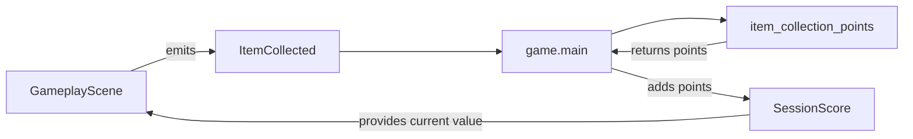

# Scoring domain

## Responsibility

The game scoring domain defines concrete point rules and accumulates the score
earned during the current game session.

It currently provides:

- `item_collection_points()`, which converts an `ItemCollected` fact into
  points;
- `SessionScore`, which stores the accumulated session total.

This domain does not persist records, update profiles, or decide when gameplay
events occur.

## Why this domain exists

Gameplay facts and their scoring consequences change for different games.

Keeping scoring in a dedicated game domain allows `GameplayScene` to report
collection without knowing its point value, while the engine remains independent
from concrete score rules.

## Public components

### [`item_collection_points`](../api/game-scoring.md#my_first_adventure_game.game.scoring.item_collection_points)

Returns the points awarded for one `ItemCollected` event.

The current rule awards 100 points regardless of the collected item identifier.

### [`SessionScore`](../api/game-scoring.md#my_first_adventure_game.game.scoring.SessionScore)

Accumulates the score for the current game session.

A new instance starts at zero. Its public `value` is read-only, and `add()`
changes the total by the supplied number of points.

## Ownership

Scoring belongs to `game` because point values, bonuses, penalties, and
progression consequences are concrete game rules.

The engine does not import scoring components or interpret gameplay events.

## Relationships

`game.main` composes the scoring flow. Its collection handler converts the
event into points and adds them to the same `SessionScore` instance displayed
by `GameplayScene`.

## Invariants

- A new session score starts at zero.
- Adding points accumulates them with the current value.
- One item collection currently awards 100 points.
- `GameplayScene` does not calculate point values.
- The engine does not depend on game scoring.

## Extension points

Concrete requirements may later introduce other event-specific point rules,
bonuses, penalties, or score presentation changes.

Persistent records and accumulated profile statistics must remain separate from
the mutable score of the current session.

## Change risks

- Moving scoring rules into `engine` would leak concrete game policy.
- Making `SessionScore` consume every gameplay event directly would couple
  storage to unrelated event types.
- Mixing persistent records into `SessionScore` would blur session and profile
  lifetimes.
- Adding a generic scoring framework before multiple rules require one would
  introduce unnecessary abstraction.

## Verification

Current tests verify:

- item collection awards 100 points;
- a session score starts at zero;
- added points accumulate;
- `game.main` converts `ItemCollected` into points and updates the session
  score;
- `GameplayScene` renders the current score.