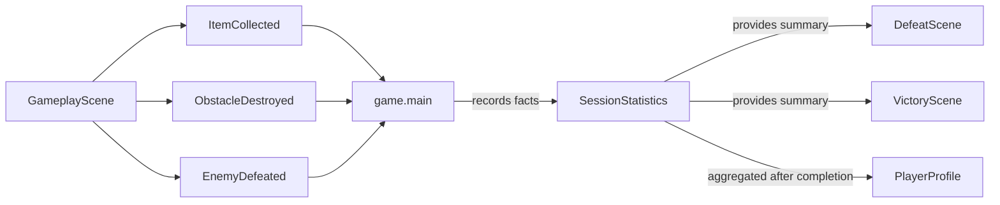

# Statistics domain

## Responsibility

The game statistics domain tracks factual counters for the current game
session.

It currently provides `SessionStatistics`, which counts:

- collected items;
- destroyed obstacles;
- defeated enemies.

It does not calculate score, decide when events occur, persist records, or
aggregate values across sessions. A completed session is instead supplied to
the game-owned profile domain for long-term aggregation.

## Why this domain exists

The result scenes need a concrete summary of what happened during one session.
Keeping these counters separate from `SessionScore` prevents factual activity
counts from becoming scoring rules and provides a clear input for profile
aggregation after a session finishes.

## Public components

### [`SessionStatistics`](../api/game-statistics.md#my_first_adventure_game.game.statistics.SessionStatistics)

Stores the current session's collected-item, destroyed-obstacle, and
defeated-enemy counts.

A new instance starts every counter at zero. Its public counters are read-only,
and the three explicit `record_*()` methods increment one corresponding fact at
a time.

## Ownership

Session statistics belong to `game` because the selected counters and their
meaning are concrete game requirements.

The engine reports no statistical policy. `GameplayScene` emits factual events
without knowing which counters, score rules, or future profile records consume
them.

## Relationships

`game.main` creates one `SessionStatistics` instance for each new game. Its
existing event handlers increment the matching counter, then preserve their
other concrete consequences. The same instance is injected into both result
scenes so victory and defeat display the facts accumulated before either
transition.

## Invariants

- Every counter starts at zero for a new session.
- Each recording operation increments exactly one counter by one.
- A new game receives a distinct statistics instance.
- Victory and defeat observe the same statistics instance as the event
  handlers for their session.
- Returning to the title does not reuse the completed session's counters.
- `SessionStatistics` does not calculate score or persist profile data.

## Extension points

Additional counters should be added only when a visible session summary or
accepted profile requirement consumes them.

`PlayerProfile` copies completed session counters into persistent game-owned
totals. Generic atomic storage remains an engine mechanism, while profile
schemas, aggregation rules, records, and migrations remain in `game`.

## Change risks

- Merging counters into `SessionScore` would mix factual statistics with point
  policy.
- Making `GameplayScene` update counters directly would couple gameplay
  detection to a particular summary.
- Persisting `SessionStatistics` itself would blur session and profile
  lifetimes.
- Adding speculative counters for every possible action would create an unused
  analytics system.

## Verification

Current tests verify:

- all three counters start at zero;
- each recording method increments its corresponding counter;
- `game.main` creates fresh statistics for consecutive sessions;
- item collection, obstacle destruction, and enemy defeat handlers record the
  matching facts;
- victory and defeat render the accumulated counters.
